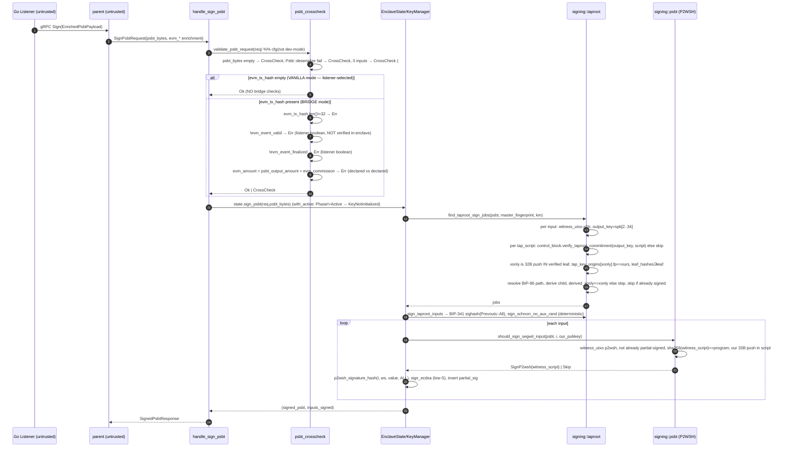

# Step 1 Flow Review — Sign PSBT (EVM → RGB lock)

**Component:** `utexo-bridge-enclave`, `dev` @ `bb2b396`.
**Flow:** an enriched `SignPsbtRequest` (a federation PSBT + EVM-event enrichment)
arrives; the TEE validates shape/policy and adds its partial signature(s) to every
input it co-owns — taproot script-path (Schnorr) and SegWit-v0 P2WSH (ECDSA).
**Reviewed:** 2026-05-29. Methodology: `internal_audit/release 1.0/prompts/`.

> The on-chain counterpart is the contracts' **FundsIn** flow. The Bitcoin tx that
> results spends federation-controlled UTXOs (multisig); this enclave is **one
> cosigner**. Whether the resulting spend is policy-correct end-to-end depends on the
> other cosigners + the federation threshold → cross-flow.

---

## 1. Code scope

| File | Symbols |
|---|---|
| `enclave/src/server.rs` | `dispatch` (SignPsbt arm :90-92), `handle_sign_psbt` (:466-481) |
| `enclave/src/validation/psbt_crosscheck.rs` | `validate_psbt_request` (:15-87) |
| `enclave/src/state.rs` | `EnclaveState::sign_psbt` (:331-333), `with_active` (:343-346) |
| `enclave/src/keys.rs` | `KeyManager::sign_psbt` (:284-347) |
| `enclave/src/signing/taproot.rs` | `find_taproot_sign_jobs` (:37-127), `sign_taproot_inputs` (:131-192) |
| `enclave/src/signing/psbt.rs` | `should_sign_segwit_input` (:33-71) |
| `proto/enclave.proto` | `SignPsbtRequest` (:172-189), `SignedPsbtResponse` (:191-194) |

Production: `--features spv,rgb-validation` (dev-mode excluded). Skipped: EVM signing,
RGB/SPV (not in this path), cloning, attestation.

---

## 2. Sequence diagram (verified against `handle_sign_psbt` → `sign_psbt`)

Annotations (non-obvious):
- **Mode is selected by `evm_tx_hash` presence** (`psbt_crosscheck.rs:42`), a
  listener-controlled field → see TEE-PS-03.
- The enclave **never inspects PSBT outputs** (destination/amount). It signs every
  input it cryptographically co-owns → see TEE-PS-02.
- `evm_token`, `evm_recipient`, `rgb_asset_id`, `operation_idx` are **never read** by
  validation or signing (TEE-PS-04).

---

## 3. Trust boundaries

### 3a. Listener/coordinator-controlled (untrusted)
| Field | TEE handling |
|---|---|
| `psbt_bytes` | Parsed; shape-whitelisted. **Outputs not validated.** Inputs signed only if anchored (PS-1). |
| `evm_tx_hash` | Presence selects mode; length-checked in bridge mode. Content not otherwise used. |
| `evm_event_valid`, `evm_event_finalized` | **Trusted booleans** — no in-enclave EVM verification (TEE-PS-01). |
| `evm_amount`, `psbt_output_amount`, `evm_commission` | Declared-vs-declared inequality only; **not tied to the PSBT outputs** (TEE-PS-02). |
| `evm_token`, `evm_recipient`, `rgb_asset_id`, `operation_idx` | **Unused** (TEE-PS-04). |

### 3b. Internal dependencies
| Dependency | Trust model |
|---|---|
| `witness_utxo.script_pubkey` | The **only** trusted PSBT field — it's the on-chain commitment (BIP-143/341). All signing authorization is anchored to it. |
| `KeyManager` (Active) | Derives BIP-84/86 children; signs only inputs whose committed script contains the derived key. |

### 3c. Off-chain assumptions
- The Bitcoin tx is a **federation multisig** spend; this enclave is one of N cosigners.
  Output-destination correctness is assumed to be enforced **by the federation /
  other cosigners**, because this enclave does not check outputs (TEE-PS-02).
- The truth of the EVM `FundsIn` deposit is assumed established **off-enclave** (the
  listener booleans), unlike the unlock direction's in-enclave RGB+SPV (TEE-PS-01).

---

## 4. Invariants

| ID | Invariant | Class | Test |
|---|---|---|---|
| PS-1 | A signature is produced for an input only if `witness_utxo.script_pubkey` cryptographically commits to a script containing the enclave's derived key (P2WSH: `sha256(witness_script)`==program + exact 33-byte push; taproot: control-block commitment + xonly-in-leaf + `derived_xonly==claimed`). | enforced (`taproot.rs:37-127`, `psbt.rs:33-71`) | existing (extensive adversarial suite) |
| PS-2 | Coordinator hint fields (`bip32_derivation`, `tap_key_origins`) cannot induce a signature not backed by the on-chain commitment. | enforced | existing (`skips_when_bip32_derivation_lies...`, `skips_when_origins_path_derives_to_different_xonly`) |
| PS-3 | The enclave never double-signs an input/leaf. | enforced (`taproot.rs:107`, `psbt.rs:45`) | existing (`skips_when_already_signed_for_leaf`, `skips_when_already_partial_signed`) |
| PS-4 | Signing requires `Phase::Active`. | enforced (`state.rs:343-345`) | existing (`sign_psbt_on_initial_errors`) |
| PS-5 | Schnorr signatures are deterministic (no RNG dependency). | enforced (`sign_schnorr_no_aux_rand`) | structural |
| PS-9 | Non-PSBT / zero-input payloads are rejected up-front. | enforced (`psbt_crosscheck.rs:30-39`, #40) | existing (`rejects_garbage_psbt_bytes`, `rejects_psbt_with_no_inputs`) |
| PS-6 | The signed PSBT corresponds to a **real, finalized EVM deposit**. | **violated/assumed** — host-trusted booleans, no in-enclave proof (TEE-PS-01) | bridge-mode tests check the booleans are *read*, not that the event is real |
| PS-7 | The PSBT **outputs** (destination, amount) match the bridge operation. | **absent** — no output validation (TEE-PS-02) | missing |
| PS-8 | Bridge-mode cross-checks are enforced for bridge operations. | **advisory** — caller selects vanilla mode (empty `evm_tx_hash`) to skip all of them (TEE-PS-03) | vanilla tests demonstrate the bypass path |

---

## 5. Security questions (with answers)

- **Can the enclave be made to sign an input it doesn't co-own?** **No** — both paths
  anchor to `witness_utxo.script_pubkey`; the "fabricated witness_script", "sliding-
  window pubkey", "lying tap_key_origins/bip32_derivation", and "control block from a
  different tree" holes all have explicit `assert jobs.is_empty()` tests. This is the
  flow's genuine, strong guarantee.
- **Can a malicious coordinator make the enclave co-sign a spend to an attacker
  address?** **Yes, to the extent the enclave co-owns the inputs** — the enclave does
  **not** inspect outputs (TEE-PS-02). Execution still needs the federation threshold
  (other cosigners) → cross-flow.
- **Do the bridge-mode checks stop a malicious listener?** **No** — the listener
  selects vanilla mode by sending empty `evm_tx_hash` (TEE-PS-03), skipping all of
  them; and even in bridge mode they are declared-vs-declared (TEE-PS-01/02).
- **Is there in-enclave verification that the EVM deposit happened?** **No** — only
  the `evm_event_valid`/`evm_event_finalized` booleans (TEE-PS-01). Asymmetric with the
  unlock direction's in-enclave RGB+SPV.
- **Replay?** Deterministic signatures; the Bitcoin UTXO model prevents double-spend.
  Re-signing an already-signed input is skipped (PS-3). No enclave nonce needed.
- **Can a non-PSBT payload crash the signer?** No — shape whitelist (PS-9).

---

## 6. Observations (fact → concern → mitigation)

- **O-1.** *Fact:* bridge mode trusts `evm_event_valid`/`evm_event_finalized`
  (`psbt_crosscheck.rs:59-70`) with no in-enclave proof. *Concern:* the lock
  direction's "real deposit?" gate is host-trusted — the opposite of the unlock
  direction's host-trust-removal (spec Sec 6.2). *Mitigation:* design question →
  TEE-PS-01.
- **O-2.** *Fact:* `psbt_output_amount` is a declared field; the enclave never sums
  the PSBT's actual outputs, and never checks output destinations. *Concern:* the
  amount gate constrains nothing about the signed tx; destination is unconstrained.
  *Mitigation:* → TEE-PS-02.
- **O-3.** *Fact:* mode is chosen by `evm_tx_hash` presence (`:42`). *Concern:* a
  malicious listener downgrades to vanilla and skips every bridge check. *Mitigation:*
  → TEE-PS-03.
- **O-4.** *Fact:* `evm_token`/`evm_recipient`/`rgb_asset_id`/`operation_idx` are never
  read. *Concern:* misleading wire contract; no destination/asset binding even
  available. *Mitigation:* doc/cleanup → TEE-PS-04.
- **O-5 (positive).** The input-anchoring suite (`taproot.rs`/`psbt.rs` tests) is the
  strongest adversarial coverage in the codebase; PS-1/PS-2 are genuinely robust.

---

## 7. Items

> Severities draft; human + spec set final. Root cause shared across PS-01/02/03:
> **the lock direction enforces input anchoring but not bridge policy.**

| ID | Type | Item | Suggested sev | Status |
|---|---|---|---|---|
| TEE-PS-01 | Design question | Bridge-mode trusts listener `evm_event_valid`/`evm_event_finalized` with no in-enclave EVM-event verification — asymmetric with the unlock direction (in-enclave RGB+SPV). Decide the intended trust model: is the TEE a policy-enforcing signer or an anchored-only cosigner? | (design — not labelled) potential High | open |
| TEE-PS-02 | Finding/observation | No PSBT **output** validation: destination unconstrained; `psbt_output_amount` is declared-vs-declared (`psbt_crosscheck.rs:73-84`), never compared to the tx's actual outputs. The enclave co-signs spends to any destination for inputs it owns. | Med–High (cross-flow, threshold-gated) | open |
| TEE-PS-03 | Finding/observation | Bridge cross-checks are bypassable: a listener selects **vanilla mode** via empty `evm_tx_hash` (`:42-45`), skipping every bridge check. Bridge-mode validation is therefore not a security boundary against a malicious listener. | Med | open |
| TEE-PS-04 | Doc/cleanup | `evm_token`, `evm_recipient`, `rgb_asset_id`, `operation_idx` are never read by the enclave; mark deprecated or wire them into a destination/asset binding. | Info | open |
| TEE-PS-05 | Observation (positive) | Input-anchoring (PS-1/PS-2) is robust and adversarially tested; keep the test suite as a regression gate for any refactor. | Info | — |

---

## 8. Tests

### Existing coverage mapped
| Inv | Test |
|---|---|
| PS-1/PS-2 | `taproot::tests::{emits_one_job_for_legit_multi_a_leaf, skips_when_control_block_does_not_verify, skips_when_origins_fingerprint_wrong, skips_when_origins_path_derives_to_different_xonly, skips_when_xonly...not_pushed..., skips_when_path_outside_bip86_accounts}`; `psbt::tests::{skips_when_witness_script_does_not_hash_to_script_pubkey, skips_when_pubkey_bytes_only_appear_inside_a_larger_push, skips_when_bip32_derivation_lies_and_script_excludes_us}` |
| PS-3 | `taproot::skips_when_already_signed_for_leaf`, `psbt::skips_when_already_partial_signed` |
| PS-4 | `state::sign_psbt_on_initial_errors` |
| PS-9 | `psbt_crosscheck::{rejects_garbage_psbt_bytes, rejects_truncated_psbt_below_magic, rejects_psbt_with_no_inputs}` |
| Bridge checks | `psbt_crosscheck::{bridge_psbt_rejects_invalid_evm_event, ...unfinalized_event, ...amount_mismatch, ...invalid_tx_hash_length}` (note: only verify booleans are *read*) |

### Missing tests
| ID | Test | Covers | Priority |
|---|---|---|---|
| TP-1 | `vanilla_mode_skips_bridge_checks_demonstrating_bypass` — bridge-shaped request with `evm_tx_hash=""` and bad evm fields still signs. Documents TEE-PS-03 (regression once mode is no longer attacker-selectable). | PS-8 / TEE-PS-03 | must-have |
| TP-2 | Output-binding test (once TEE-PS-02 defines a rule): reject a PSBT whose outputs don't match the declared/derived destination+amount. | PS-7 / TEE-PS-02 | blocked on design |
| TP-3 | In-enclave EVM-event check (if TEE-PS-01 adds one): reject when the deposit isn't provable. | PS-6 / TEE-PS-01 | blocked on design |
| TP-4 | `signs_multiple_owned_inputs_in_one_psbt` — confirm/limit multi-input behaviour. | PS-1 | should-have |

---

## 9. Status summary

- **Strong guarantee (enforced + adversarially tested):** the enclave signs **only**
  inputs cryptographically anchored to `witness_utxo.script_pubkey` and never trusts
  coordinator hint fields (PS-1/PS-2/PS-3/PS-9). This is the best-tested area of the
  codebase.
- **Gap (root cause):** the lock direction enforces **input anchoring but not bridge
  policy** — EVM-event truth is host-trusted (TEE-PS-01), PSBT outputs are unvalidated
  (TEE-PS-02), and bridge-mode checks are listener-bypassable (TEE-PS-03). These are
  the lock-direction analogue of the unlock-direction's recipient/OpId gaps
  (TEE-SE-02/03) and depend on the federation-threshold model for end-to-end severity.
- **No items duplicated** from prior flows; the PSBT findings are flow-specific.
- **Missing tests:** TP-1 (mode bypass), TP-2/TP-3 (blocked on the TEE-PS-01/02 design
  decision).
- **Next:** Step 2 attack analysis for this flow.

### Self-verification (review rules §12)
- [x] Every reject condition written as coded (`!evm_event_valid → Err`, `sha256(ws)==program else Skip`, etc.).
- [x] Every named symbol verified in source.
- [x] Diagram order matches `handle_sign_psbt`→`sign_psbt` (taproot pass then segwit pass).
- [x] Design questions (TEE-PS-01) not labelled findings/severity; findings (PS-02/03) given draft severity.
- [x] Invariants are violable safety properties + test status (PS-6/7/8 violated/absent/advisory).
- [x] No invented checks (confirmed evm_token/recipient/rgb_asset_id/operation_idx unused by grep of the handler/crosscheck).
- [x] Scope: federation-threshold / on-chain FundsIn explicitly deferred.
