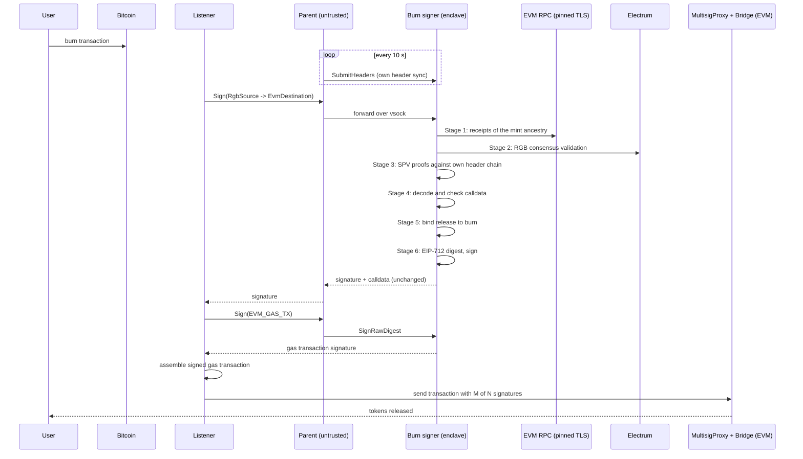

# Burn flow (RGB -> EVM)

**Signer image:** `burn-signer` (`--no-default-features --features vsock,rgb,burn-signer`).
**Checked against repository code:** 2026-10-05. Deployment was not checked.

This document tells how the burn signer checks and signs a release. The
[spec](tee-spec.md) describes the rules and known limits. If the code and this
document differ, investigate the difference. Either can contain an error.

## 1. What the burn flow does

1. The user burns RGB units on Bitcoin.
2. The burn records how many units it destroys and which EVM address gets
   the tokens.
3. The burn signer checks the burn.
4. The burn signer signs an EIP-712 release for `MultisigProxy`.
5. `MultisigProxy` needs M of N such signatures. Then the Bridge contract
   releases the tokens to the user.

The burn signer signs nothing on Bitcoin.

## 2. Who does what

| Part | Where | Trusted for | Job |
|------|-------|-------------|-----|
| User | Bitcoin | - | Burns RGB units. |
| Backend and listener | Operator servers | Nothing | Build the `fundsOut` calldata. Send the request. |
| Parent | EC2 host | Nothing | Moves bytes. Sends Bitcoin headers to the enclave. |
| Burn signer | Nitro Enclave | Checks and keys | Checks the burn. Signs the release and the gas transaction. |
| EVM RPC | Pinned TLS host | Receipt and chain-head data | Gives the receipts of the deposits behind the burn. |
| Electrum | Through vsock proxy | Bitcoin data, subject to the checks below | Supplies transactions and witness status for RGB validation. |
| `MultisigProxy` and Bridge | EVM | Quorum and replay | Count signatures. Use the nonce. Check `burnId` again. |

The burn signer checks request claims before it signs. It derives the burn
amount from the consignment. It trusts the pinned EVM RPC for deposit receipts
and chain-head data. It does not verify EVM consensus.

On mainnet, SPV checks witness inclusion against the enclave header chain.
Signet and regtest do not enforce proof of work. See
[Bitcoin network limits](tee-spec.md#8-rgb--bitcoin--spv-verification).

## 3. Sequence

## 4. Key values

| Name | Value | Meaning |
|------|-------|---------|
| `TS_BURN` | 8010 | Burn transition. The only last transition the burn signer accepts. |
| `TS_BRIDGE` | 8014 | Mint transition. It shows in the burn's history (the ancestry). |
| `MS_BURNED_ASSET` | 1001 | Burn metadata: the number of units destroyed (u64). |
| `MS_BURN_RECIPIENT` | 1003 | Burn metadata: 32 bytes. A left-padded EVM address. |
| `RGB_SOURCE_CHAIN_ID` | 96 | The bridge's id for the RGB network. Compiled in. |
| `SPV_MIN_CONFIRMATIONS` | 6 | Minimum depth of each Bitcoin transaction. |
| `SPV_MAX_TIP_AGE_SECS` | 7200 | Maximum age of the header-chain tip. |
| `SPV_MAX_TIP_FUTURE_SECS` | 7200 | Maximum time the tip can be in the future. |
| `MAX_RELAY_TIP_LAG_BLOCKS` | 100 | Maximum distance from the BtcRelay tip to the enclave tip. |
| `EVM_MIN_CONFIRMATIONS` | 12 (default) | Minimum depth of each deposit receipt. Attested. |
| `fundsOut` selector | `0x340276aa` | Pools route. |
| `lzFundsOut` selector | from the enclave ABI | LayerZero route. |
| Calldata cap | 64 KiB | Maximum calldata size. |
| EIP-712 domain | `("MultisigProxy", "1", chainId, verifyingContract)` | Tests compare it with contract fixtures. |

## 5. Checks, in order

If one check fails, the burn signer stops. It signs nothing. It returns an
error.

### Stage 0 - Can this enclave do this request?

- **B0.1** The endpoints must be set (`SetEndpoints`).
- **B0.2** The source must be RGB and the destination must be EVM. The burn
  signer refuses a mint request.

The enclave must be `Active`, but no check runs here. Signing (Stage 6) is
the first step that reads the keys. It refuses an enclave without keys.

### Stage 1 - Are the deposits behind the burn real?

The burned units came from earlier mints. Each mint has an EVM deposit. The
burn signer checks each deposit before it validates the consignment.

- **B1.1** The consignment must not be larger than `MAX_CONSIGNMENT_BYTES`
  (default 8 MiB).
- **B1.2** The asset's `bridgeLocation` must equal the pinned
  `FUNDS_IN_CONTRACT`.
- **B1.3** Each `TS_BRIDGE` (mint) in the consignment must have a
  `mint_ancestors` entry with a 32-byte EVM transaction hash.
- **B1.4** For each mint, the burn signer gets the receipt itself:
  - the receipt must be a success;
  - it must have exactly one `FundsIn` event from `FUNDS_IN_CONTRACT`, with
    the mint's RGB OpId;
  - it must have exactly one `BridgeFundsIn` event from the same contract;
  - it must be at least `EVM_MIN_CONFIRMATIONS` blocks deep.
- **B1.5** The result is a list of verified locks: `(operationId, netAmount)`.
  Stage 2 and Stage 5 use this list.

### Stage 2 - Is the RGB history valid?

- **B2.1** Proof count must be at most `MAX_MERKLE_PROOFS` (default 16384).
  Proof bytes must be at most `MAX_TOTAL_PROOF_BYTES` (default 8 MiB).
- **B2.2** `keccak256(consignment)` must equal `consignment_hash`. This check
  finds a damaged copy only. It is not a safety proof.
- **B2.3** Full RGB consensus validation runs. BFA is the only schema. Each
  mint must match a verified lock from Stage 1.
- **B2.4** The contract id must equal the declared `asset_id` and the pinned
  `RGB_ASSET_ID`.
- **B2.5** The last transition must be `TS_BURN`. The amount comes from
  `MS_BURNED_ASSET`. The burn signer does not use the amount from the host.

### Stage 3 - Is the burn buried in Bitcoin?

The parent sends block headers. The burn signer builds its own header chain.
On mainnet, it checks linkage, proof of work, and `nBits`. It accepts a
replacement chain only when it has more work and meets the reorganization
limits. Signet and regtest skip proof-of-work and `nBits` checks.

- **B3.1** The tip must not be older than 2 hours. It must not be more than
  2 hours in the future.
- **B3.2** The consignment's network (`chain_net`) must equal the enclave's
  Bitcoin network.
- **B3.3** The Merkle proofs must be exactly the set of witness transactions
  in the consignment. None missing. None extra. No duplicates.
- **B3.4** Each Merkle path must be at most 32 levels. Each proof must verify
  against the header that the enclave stores at that height.
- **B3.5** Each witness transaction must be at least 6 blocks deep.
- **B3.6** The enclave records the heights and hashes it used. Just before it
  uses the key, it checks that they did not change.

### Stage 4 - Is the calldata correct?

- **B4.1** Calldata must be at least 4 bytes and at most 64 KiB.
- **B4.2** The selector must be `fundsOut` (`0x340276aa`) or `lzFundsOut`.
- **B4.3** The burn signer decodes the calldata and encodes it again. The two
  must be byte-equal. This stops a non-canonical encoding.
- **B4.4** The decoded amount must equal the request's `calldata_amount`. It
  must fit in a u64.
- **B4.5** `chain_id` must equal the pinned `EVM_CHAIN_ID`. `proxy_contract`
  must equal the pinned `EVM_PROXY_CONTRACT_ADDRESS`.
- **B4.6** `destinationChainId`:
  - pools route: must equal `EVM_CHAIN_ID`;
  - LayerZero route: must not be zero, and must not equal `EVM_CHAIN_ID`.
- **B4.7** The deadline must be in the future.

### Stage 5 - Does the release belong to this burn?

Both routes (`fundsOut` and `lzFundsOut`), in this order:

- **B5.1** The burned amount must be at least the calldata amount.
- **B5.2** `sourceChainId` must equal 96 (`RGB_SOURCE_CHAIN_ID`).
- **B5.3** `sourceAddress` must be empty. RGB has no source address.
- **B5.4** The burn signer calculates `burnId` the same way as
  `Bridge._deriveBurnIdFromFields`. It uses the pinned `FUNDS_IN_CONTRACT`,
  `EVM_CHAIN_ID` and `TOKEN_CONTRACT`, and the calldata fields. The calldata
  `burnId` must be equal.
- **B5.5** BtcRelay proof: the calldata `proof` is
  `(sourceHeight, sourceCommit, latestHeight, latestCommit)`, 128 bytes.
  - `sourceHeight` must be the block that holds the last witness transaction.
  - The enclave must have a header at `latestHeight`. That header must be at
    most 100 blocks below the enclave tip.
  - With `BTC_RELAY_MODE=required` (the production mode), each commit word must
    equal `keccak256` of the 160-byte BtcRelay record that the enclave builds
    from its own chain. A zero word is refused.
  - With `BTC_RELAY_MODE=none` (local stand only), both words must be zero.
    A production policy does not boot in this mode.
- **B5.6** Amount: `MS_BURNED_ASSET` must **equal** the calldata `amount`.
- **B5.7** Burn id: `sourceBurnTxId` must not be zero. It must equal the
  OpId of the burn transition.
- **B5.8** Recipient: `MS_BURN_RECIPIENT` must be 32 bytes. The high 12 bytes
  must be zero. It must equal the final payee: the calldata `recipient`,
  left-padded, on the pools route, or the LayerZero `recipient` on the
  LayerZero route.
- **B5.9** Settlement: `settlementData` is
  `abi.encode(bytes32[] operationIds, uint256[] netAmounts)`. It must be
  canonical. The two arrays must have the same length. The ids must be in
  strictly ascending order, so no id repeats. The pairs must equal, as a set,
  the verified locks from Stage 1. An empty list is refused.

> **Warning - LayerZero route.** The burn does not name a destination chain,
> so `dst_eid` is not bound to the burn. The enclave checks `dst_eid` and
> `min_amount_ld` against the request only. See
> [spec Sec 13](tee-spec.md#13-implementation-status).

### Stage 6 - Sign

- **B6.1** The domain is `("MultisigProxy", "1", chainId, verifyingContract)`.
- **B6.2** The digest uses the **decoded fields**, never the raw bytes:
  - pools route: `TeeFundsOut(recipient, amount, burnId, sourceChainId,
    destinationChainId, sourceAddress, proof, settlementData,
    sourceBurnTxId, nonce, deadline)`;
  - LayerZero route: `TeeLzFundsOut(...)`, 14 fields.
- **B6.3** The burn signer signs with the EVM bridge key `m/44'/60'/0'/0/0`.
  The signature is 65 bytes (`r || s || v`, `v` is 0 or 1).
- **B6.4** The response has the signature and the calldata. The calldata is
  not changed.

This path creates only `TeeFundsOut` and `TeeLzFundsOut` digests. It does not
create a batch digest. The receiving contract must interpret these signatures
according to the same ABI.

## 6. The gas transaction (`SignRawDigest`)

The burn signer also signs the EVM transaction that sends the release. It
uses the gas key `m/44'/60'/0'/0/1`.

- **G1** The request must have the unsigned transaction. The enclave
  calculates the digest itself.
- **G2** RLP decode must be strict and canonical. EIP-1559 and legacy EIP-155
  are accepted.
- **G3** `chain_id` must equal `EVM_CHAIN_ID`. `to` must equal
  `GAS_TX_ALLOWED_TO`. Contract creation is refused.
- **G4** `gasLimit` must be at most `GAS_TX_MAX_GAS_LIMIT`. Each fee field must
  be at most `GAS_TX_MAX_FEE_PER_GAS`.
- **G5** Calldata must start with a selector in `GAS_TX_ALLOWED_SELECTORS`.
  Empty calldata is refused.
- **G6** `value` must be zero. One exception: the payable `lzFundsOutCall` to
  `EVM_PROXY_CONTRACT_ADDRESS`, with `value` at most `GAS_TX_MAX_VALUE_WEI`.
- **G7** The destination, gas ceiling, fee ceiling, and selector allowlist
  must be configured. An unset value ceiling prevents non-zero `value`. It
  does not prevent a transaction with zero `value`.

The gas rule is part of the attested policy. The gas transaction is not
linked to one checked release. The limits apply to one transaction, not to a
sum of transactions.

## 7. Replay

The burn signer keeps no replay state for releases. Replay protection is on
chain:

- the `MultisigProxy` nonce is in the signed digest;
- the Bridge refuses a `burnId` that it used before.

On both routes, `burnId` is bound to the burn through B5.7 and B5.9.

## 8. What the burn signer refuses

| Request | Result |
|---------|--------|
| `Sign` with an EVM source or an RGB destination (mint) | Refused: wrong signer role. |
| `SignBtc` | Refused: wrong signer role. |
| `SignCcd` | Refused: not in this build. |
| `SignRawMessage` | Refused in every build. |

## 9. The main idea

A burn has no output that holds the destroyed value. The amount and the payee
are in the burn's metadata. So the burn signer needs three proofs that agree:

1. RGB consensus: the burn is valid.
2. SPV: the burn's Bitcoin transaction is buried.
3. Metadata: the amount and the payee in the burn equal those in the calldata.

The contract proves that the cited deposits exist. The burn signer proves that
they are the deposits behind this burn (B5.9). Each half needs the other.
