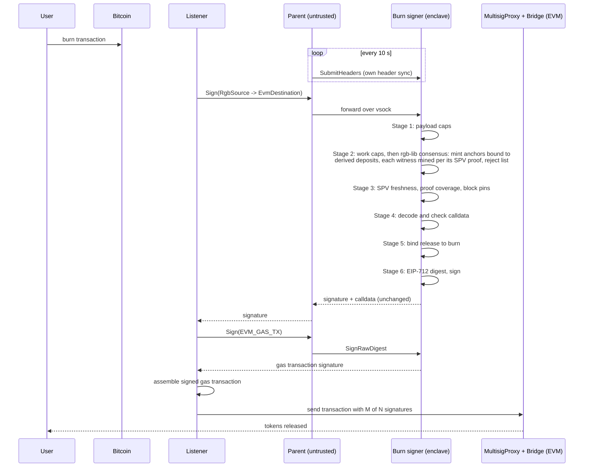

# Burn flow (RGB -> EVM)

**Signer image:** `burn-signer` (`--no-default-features --features vsock,rgb,burn-signer`).
**Checked against repository code:** 2026-10-29 (rgb-lib f3975623 move, burns
validated by rgb-lib's `validate_consignment_with_resolver`).
Deployment was not checked.

This document tells how the burn signer checks and signs a release. The
[spec](tee-spec.md) describes the rules and known limits. If the code and this
document differ, investigate the difference. Either can contain an error.

## 1. What the burn flow does

1. The user burns RGB units on Bitcoin.
2. The burn records how many units it destroys (`burnedAsset`) and which
   destination gets the tokens (`burnReason`: an EVM address, or the hash of a
   destination record, see [burn-destination.md](burn-destination.md)). A
   burn has no outputs: rgb-lib first splits the units in a transfer of the
   same bundle, which keeps the change, and the burn destroys the split's
   other output.
3. The burn signer checks the burn.
4. The burn signer signs an EIP-712 release for `MultisigProxy`.
5. `MultisigProxy` needs M of N such signatures. Then the Bridge contract
   releases the tokens to the user.

The burn signer signs nothing on Bitcoin.

## 2. Who does what

| Part | Where | Trusted for | Job |
|------|-------|-------------|-----|
| User | Bitcoin | - | Burns RGB units. |
| Backend and listener | Operator servers | Nothing | Build the `fundsOut` calldata. Send the request. |
| Parent | EC2 host | Nothing | Moves bytes. Sends Bitcoin headers to the enclave. |
| Burn signer | Nitro Enclave | Checks and keys | Checks the burn. Signs the release and the gas transaction. |
| `MultisigProxy` and Bridge | EVM | Quorum and replay | Count signatures. Use the nonce. Check `burnId` again. |

The burn signer checks request claims before it signs. It derives the burn
amount from the consignment. It reads no Bitcoin indexer, and reads the EVM
RPC only for an asset whose genesis names a reject list (Stage 3b): the
deposits behind the burn are derived, and the witnesses are checked on chain against
the enclave's own header chain. One call of rgb-lib's
`validate_consignment_with_resolver` runs RGB consensus. It takes each witness
transaction from the consignment, but the enclave's resolver treats it as mined
only if a Merkle proof in the request places it at least
`SPV_MIN_CONFIRMATIONS` deep in that chain. An unmined witness anywhere in the
history fails consensus. So two conflicting
off-chain transfers of the same units cannot both back a burn: only one of
them can be mined.

On mainnet and testnet4, SPV checks witness inclusion against the enclave
header chain with proof of work. On testnet4, min-difficulty blocks count as
confirmations and freshness, for testing convenience: testnets carry no
production value. Signet and regtest do not enforce proof of work. See
[Bitcoin network limits](tee-spec.md#8-rgb--bitcoin--spv-verification).

## 3. Sequence

```mermaid
sequenceDiagram
    participant U as User
    participant BT as Bitcoin
    participant L as Listener
    participant P as Parent (untrusted)
    participant E as Burn signer (enclave)
    participant C as MultisigProxy + Bridge (EVM)

    U->>BT: burn transaction
    loop every 10 s
        P->>E: SubmitHeaders (own header sync)
    end
    L->>P: Sign(RgbSource -> EvmDestination)
    P->>E: forward over vsock
    E->>E: Stage 1: payload caps
    E->>E: Stage 2: work caps, then rgb-lib consensus: mint anchors bound to<br/>derived deposits, each witness mined per its SPV proof, reject list
    E->>E: Stage 3: SPV freshness, proof coverage, block pins
    E->>E: Stage 4: decode and check calldata
    E->>E: Stage 5: bind release to burn
    E->>E: Stage 6: EIP-712 digest, sign
    E-->>P: signature + calldata (unchanged)
    P-->>L: signature
    L->>P: Sign(EVM_GAS_TX)
    P->>E: SignRawDigest
    E-->>L: gas transaction signature
    L->>L: assemble signed gas transaction
    L->>C: send transaction with M of N signatures
    C-->>U: tokens released
```

## 4. Key values

| Name | Value | Meaning |
|------|-------|---------|
| `TS_BURN` | 8010 | Burn transition. The only settling transition the burn signer accepts. |
| `TS_MINT` | 8013 | Mint transition. It shows in the burn's history (the ancestry). |
| `GS_BURNED_ASSET` | 2015 | Burn global: the number of units destroyed (u64). Required. |
| `GS_REJECT_LIST` | 3010 | Genesis global: where the reject list is. The enclave reads only an `IRgbRejectList` contract on `EVM_CHAIN_ID` (B3.7). |
| `GS_BURN_REASON` | 3009 | Burn global: 32 bytes. A left-padded EVM address (V0), or the hash of a destination record (V1). See [burn-destination.md](burn-destination.md). Required. |
| `RGB_CHAIN_ID` | 827166 | The bridge's id for the RGB network. Compiled in. |
| `SPV_MIN_CONFIRMATIONS` | 6 (default) | Minimum depth of each Bitcoin transaction. Image env, attested. Zero stops the boot. |
| `SPV_MAX_TIP_AGE_SECS` | 7200 | Maximum age of the header-chain tip. |
| `SPV_MAX_TIP_FUTURE_SECS` | 7200 | Maximum time the tip can be in the future. |
| `MAX_RELAY_TIP_LAG_BLOCKS` | 100 | Maximum distance from the BtcRelay tip to the enclave tip. |
| `fundsOut` selector | `0x340276aa` | Pools route. |
| `lzFundsOut` selector | from the enclave ABI | LayerZero route. |
| Calldata cap | 96 KiB | Maximum calldata size. |
| EIP-712 domain | `("MultisigProxy", "1", chainId, verifyingContract)` | Tests compare it with contract fixtures. |

## 5. Checks, in order

If one check fails, the burn signer stops. It signs nothing. It returns an
error.

### Stage 0 - Can this enclave do this request?

- **B0.1** The endpoints must be set (`SetEndpoints`).
- **B0.2** The source must be RGB and the destination must be EVM. The burn
  signer refuses a mint request.

The enclave must be `Active`, but no check runs here. Signing (Stage 6) is
the first step that reads the keys. It refuses an enclave without keys.

### Stage 1 - Is the request within the caps?

- **B1.1** The consignment must not be larger than `MAX_CONSIGNMENT_BYTES`
  (default 12 MiB).
- **B1.2** Proof count must be at most `MAX_MERKLE_PROOFS` (default 16384).
  Proof bytes must be at most `MAX_TOTAL_PROOF_BYTES` (default 8 MiB).
- **B1.3** `keccak256(consignment)` must equal `consignment_hash`. This check
  finds a damaged copy only. It is not a safety proof.

### Stage 2 - Is the RGB history valid, and is each mint backed?

- **B2.1** The bytes must be a V1 transfer file (`TFR`). The genesis schema
  must be BFA. If the genesis names a reject list (`GS_REJECT_LIST`), it must
  be an EVM contract; a URL list is refused.
- **B2.2** Before rgb-lib runs, the contract id must pass the asset bind
  (B2.7), so a foreign genesis never reaches rgb-lib, and no foreign contract
  is ever read as its list. Then the enclave bounds rgb-lib's work on the
  parsed transfer (`validation/cost.rs`). In phase 1, before any witness is
  checked, rgb-lib builds the opouts DAG for every BFA (the k inputs of one
  transition cost about k^2 steps) and checks each transition against the
  whole witness tx, anchor and input map of its bundle. So the sum of k^2 over
  the whole history must be at most `MAX_OPOUTS_DAG_COST`; the sum over
  bundles of transitions x (tx bytes + Tapret partner leaf bytes) plus seals x
  tx inputs at most `MAX_WITNESS_CHECK_COST`; and the sum over bundles of
  (transitions + 1) x input map entries at most `MAX_BUNDLE_ID_COST`. If
  the genesis names a reject list, the enclave also counts rgb-lib's reject
  walk (B3.10), one walk per origin with no list entry to cut it short, which
  must be at most `MAX_REJECT_WALK_COST`. The caps add up on top of the
  file's own cost, so the modeled rgb-lib time of the file bytes and the four
  costs together must be at most `MAX_RGB_LIB_NS` (18 s). The caps and the
  timings behind them are in [Work caps](#10-work-caps).
- **B2.3** One call of rgb-lib's `validate_consignment_with_resolver` runs
  consensus phase 1 over the whole history under the BFA rules from
  `rgb-schemas`, then phase 2 through three resolvers of the enclave: the
  witness resolver (B2.9), the anchor resolver (B2.4, B2.5) and the reject-list
  resolver (Stage 3b). No `safe_height` is passed: the witness resolver already
  enforces the depth. rgb-lib must report the transfer the enclave parsed (same
  consignment id) and no warning; neither of its warnings can arise with this
  resolver, so one refuses. Each mint leaves an anchor: its OpId and its
  `issuedSupply`.
- **B2.4** The anchor resolver asks the binder once with no anchor: the
  genesis `bridgeLocation` must name the pinned `FUNDS_IN_CONTRACT` on
  `EVM_CHAIN_ID`, and rgb-lib compares that chain id with the genesis one. Then
  it asks once per anchor. For each anchor, the burn signer derives the
  `operationId` of the one deposit that can back it:
  `keccak256(abi.encode(RGB_MINT_DEPOSIT_TYPEHASH, FUNDS_IN_CONTRACT,
  EVM_CHAIN_ID, TOKEN_CONTRACT, RGB_CHAIN_ID, mint OpId, minted units))`. It
  reads nothing from the chain. `TOKEN_CONTRACT` and `EVM_CHAIN_ID` must be
  pinned.
- **B2.5** rgb-lib confirms each anchor only against its derived lock, one
  for one; rgb-lib makes no RPC for it. The Bridge holds a record under that id only if a
  deposit of exactly the minted units was made for that mint, and the release
  checks each cited record, so a mint with no deposit fails on chain.
- **B2.6** The result is a list of locks: deposit `operationId`s. One burn
  has one list, so one `settlementData`; `burnId` does not hash it. Stage 5
  uses this list.
- **B2.7** The contract id must equal the declared `asset_id` and the pinned
  `RGB_ASSET_ID`.
- **B2.8** The settling transition must be `TS_BURN`: the burn of the last
  witness, so one tx also carries rgb-lib's split (or a plain transfer). Two
  burns there are refused. The amount comes from `burnedAsset`, never from
  the outputs or the host. The flat summary of each transition (the split's
  outputs included) comes from our parser, `rgb-consignment`
  (consignment-utils), as the bridge reads it. rgb-lib returns no amounts or
  burn facts, so these are read from the same bytes once rgb-lib passed them.
- **B2.9** The witness resolver resolves every witness, the burn included, on
  chain: the transaction comes from the consignment, its block from the
  request's Merkle proof for it. That proof must pass B3.4 and B3.5 first. A
  witness with no such proof is unmined and fails consensus. A proof the
  consignment itself carries is never used: the resolver serves no block
  headers, so rgb-lib asks it instead. Stage 3 runs these proof checks again
  with coverage and pins.

### Stage 3 - Is the burn buried in Bitcoin?

The parent sends block headers. The burn signer builds its own header chain.
On mainnet and the testnets, it checks linkage, proof of work, and `nBits`.
On testnet4 it applies the 20-minute rule and BIP94 (retarget from the first
block of the period, the timewarp rule). On every network a header may be at
most 2 hours ahead of the enclave clock, so a host cannot date free blocks
ahead to lower its fork's difficulty. It accepts a replacement chain only
when it has more work and meets the reorganization limits. Signet and regtest
skip proof-of-work and `nBits` checks.

- **B3.1** The chain tip must not be older than 2 hours, nor more than 2
  hours in the future. On the testnets a min-difficulty tip counts.
- **B3.2** The consignment's network (`chain_net`) must equal the enclave's
  Bitcoin network.
- **B3.3** The Merkle proofs must be exactly the set of witness transactions
  in the consignment. None missing. None extra. No duplicates.
- **B3.4** Each Merkle path must be at most 32 levels. Each proof must verify
  against the header that the enclave stores at that height.
- **B3.5** Each witness transaction must be at least `SPV_MIN_CONFIRMATIONS`
  blocks deep (default 6). On the testnets min-difficulty blocks count.
- **B3.6** The enclave records the heights and hashes it used. Just before it
  uses the key, it checks that they did not change.

### Stage 3b - Did the issuer reject the burned units?

Only for an asset whose genesis names a reject list. rgb-lib runs it at the
end of its validation (B2.3), once every witness and anchor passed, through
the enclave's reject-list resolver. So it refuses, and reads the EVM RPC,
before the Stage 3 checks that run after rgb-lib (B3.1, B3.3 and B3.6); B3.4
and B3.5 already passed for every proof the witness resolver uses. The asset
bind ran before rgb-lib (B2.2), so a foreign genesis cannot make the signer read a contract of its
choice. The resolver reads only the list that genesis names, and a failed
read refuses with the reader's own error. The reads trust the pinned EVM RPC for their
contents, as the trust table in tee-spec.md states: TLS authenticates the
endpoint, not the answers.

- **B3.7** The list must be on `EVM_CHAIN_ID`, and the node must report it.
  Another chain is refused: the enclave has no RPC for it.
- **B3.8** Over the pinned EVM RPC: the latest block and the `finalized`
  block (capped at the latest), `length()` at both, then `entries` in pages of
  1000 at the latest block. Any RPC error, no code at the latest block, a list
  shorter at the latest block, a bad or short page, or more than 20,000
  entries refuses. About 5 calls plus one per 1000 entries; the history
  length does not matter. A call that, at the pace of the slowest call so
  far, would end within 2 s of the 30 s request deadline is not started:
  the read refuses with "exceeded the request budget".
- **B3.9** Decisions: the latest finalized entry for an opout wins. A
  pending reject counts at once, also over a finalized allow. A pending allow
  does not count. `finalized` is fixed in code, not `EVM_FINALITY_TAG`, so the
  signer never releases what an rgb-lib wallet still refuses.
- **B3.10** rgb-lib's rule: the origins are the inputs and the outputs of
  every terminal operation of the consignment, the ones nothing in it builds
  on. Each origin is walked back through rgb-lib's opouts DAG. An allowed
  opout stops its branch. A rejected opout on a branch nothing stopped refuses
  the release ("Consignment rejected by the reject list"). The burn has no
  outputs, so its inputs are origins; its input is the split's output, so the
  walk goes through the split to the burned units. The split itself is not
  terminal (the burn spends its output), so the change on it is not checked.
  This rule is stricter than the burn's inputs alone: a companion transfer of
  the same bundle is terminal too, so a rejected line behind it refuses the
  release even when the burned units do not descend from it.

### Stage 4 - Is the calldata correct?

- **B4.1** Calldata must be at least 4 bytes and at most 96 KiB.
- **B4.2** The selector must be `fundsOut` (`0x340276aa`) or `lzFundsOut`.
- **B4.3** The burn signer decodes the calldata and encodes it again. The two
  must be byte-equal. This stops a non-canonical encoding.
- **B4.4** The decoded amount must equal the request's `calldata_amount`. It
  must fit in a u64.
- **B4.5** `chain_id` must equal the pinned `EVM_CHAIN_ID`. `proxy_contract`
  must equal the pinned `EVM_PROXY_CONTRACT_ADDRESS`.
- **B4.6** `destinationChainId`:
  - pools route: must equal `EVM_CHAIN_ID`;
  - LayerZero route: must not be zero, and must not equal `EVM_CHAIN_ID`.
- **B4.7** The deadline must be in the future, and at most 1 day after now
  (`MAX_TEE_DEADLINE_SECS`, the same value as `MultisigProxy.MAX_TEE_DEADLINE`).
  So every signature expires 1 day after signing.
- **B4.8** LayerZero route only: `minAmountLD` must be > 0 and at most `amount`.
  The backend sets it from the net quoted at signing.
- **B4.9** LayerZero route only: `extraOptions` must be empty or one executor
  `lzReceive` gas option (type 3, no value), with gas at most
  `MAX_LZ_RECEIVE_GAS`. Native drop, compose and every other option are refused.

### Stage 5 - Does the release belong to this burn?

Both routes (`fundsOut` and `lzFundsOut`), in this order:

- **B5.1** The burned amount must be at least the calldata amount.
- **B5.2** `sourceChainId` must equal 827166 (`RGB_CHAIN_ID`).
- **B5.3** `sourceAddress` must be empty. RGB has no source address.
- **B5.4** The burn signer calculates `burnId` the same way as
  `Bridge._deriveBurnIdFromFields`. It uses the pinned `FUNDS_IN_CONTRACT`,
  `EVM_CHAIN_ID` and `TOKEN_CONTRACT`, and the calldata fields. The calldata
  `burnId` must be equal.
- **B5.5** BtcRelay proof: the calldata `proof` is
  `(sourceHeight, sourceCommit, latestHeight, latestCommit)`, 128 bytes.
  - `sourceHeight` must be the block that holds the last witness transaction.
  - The enclave must have a header at `latestHeight`. That header must be at
    most 100 blocks below the enclave tip.
  - With `BTC_RELAY_MODE=required` (the production mode), each commit word must
    equal `keccak256` of the 160-byte BtcRelay record that the enclave builds
    from its own chain. A zero word is refused.
  - With `BTC_RELAY_MODE=none` (local stand only), both words must be zero.
    A production policy does not boot in this mode.
- **B5.6** Amount: `burnedAsset` must **equal** the calldata `amount`.
- **B5.7** Burn id: `sourceBurnTxId` must not be zero. It must equal the
  OpId of the burn transition.
- **B5.8** Destination: `burnReason` must be present.
  - High 12 bytes zero (V0): the low 20 bytes are an EVM address. The request
    must carry no `burn_destination`. Pools route only. The calldata
    `recipient` must equal the address.
  - Otherwise (V1): the request must carry `burn_destination`, and its hash
    must equal the 32 bytes ([burn-destination.md](burn-destination.md)).
    `destinationChainId` must equal the record. `dstEid == 0` means the pools
    route, with a 20-byte `recipient` equal to the calldata. `dstEid != 0`
    means the LayerZero route: the calldata `dstEid` must equal it, and the
    left-padded record `recipient` must equal the LayerZero `recipient`.
- **B5.9** Settlement: `settlementData` is
  `abi.encode(bytes32[] operationIds)`. It must be canonical. The ids must be
  in strictly ascending order, so no id repeats. They must equal, as a set,
  the locks consensus confirmed in Stage 2. An empty list is refused.

> **Note - LayerZero route.** Only a V1 burn can leave via LayerZero, because
> only V1 names a chain. `min_amount_ld` is checked against the request only.

### Stage 6 - Sign

- **B6.1** The domain is `("MultisigProxy", "1", chainId, verifyingContract)`.
- **B6.2** The digest uses the **decoded fields**, never the raw bytes:
  - pools route: `TeeFundsOut(recipient, amount, burnId, sourceChainId,
    destinationChainId, sourceAddress, proof, settlementData,
    sourceBurnTxId, nonce, deadline)`;
  - LayerZero route: `TeeLzFundsOut(...)`, 14 fields.
- **B6.3** The burn signer signs with the EVM bridge key `m/44'/60'/0'/0/0`.
  The signature is 65 bytes (`r || s || v`). `v` is the raw recovery id, 0 to 3, with no +27.
- **B6.4** The response has the signature and the calldata. The calldata is
  not changed.

This path creates only `TeeFundsOut` and `TeeLzFundsOut` digests. It does not
create a batch digest. The receiving contract must interpret these signatures
according to the same ABI.

## 6. The gas transaction (`SignRawDigest`)

The burn signer also signs the EVM transaction that sends the release. It
uses the gas key `m/44'/60'/0'/0/1`.

- **G1** The request must have the unsigned transaction. The enclave
  calculates the digest itself.
- **G2** RLP decode must be strict and canonical. EIP-1559 and legacy EIP-155
  are accepted.
- **G3** `chain_id` must equal `EVM_CHAIN_ID`. `to` must equal
  `GAS_TX_ALLOWED_TO`. Contract creation is refused.
- **G4** `gasLimit` must be at most `GAS_TX_MAX_GAS_LIMIT`. Each fee field must
  be at most `GAS_TX_MAX_FEE_PER_GAS`.
- **G5** Calldata must start with a selector in `GAS_TX_ALLOWED_SELECTORS`.
  Empty calldata is refused.
- **G6** `value` must be zero. One exception: the payable `lzFundsOutCall` to
  `EVM_PROXY_CONTRACT_ADDRESS`, with `value` at most `GAS_TX_MAX_VALUE_WEI`.
- **G7** The destination, gas ceiling, fee ceiling, and selector allowlist
  must be configured. An unset value ceiling prevents non-zero `value`. It
  does not prevent a transaction with zero `value`.

The gas rule is part of the attested policy. The gas transaction is not
linked to one checked release. The limits apply to one transaction, not to a
sum of transactions.

## 7. Replay

The burn signer keeps no replay state for releases. Replay protection is on
chain:

- the `MultisigProxy` nonce is in the signed digest;
- the Bridge refuses a `burnId` that it used before.

On both routes, `burnId` is bound to the burn through B5.3, B5.6 and B5.7.

## 8. What the burn signer refuses

| Request | Result |
|---------|--------|
| `Sign` with an EVM source or an RGB destination (mint) | Refused: wrong signer role. |
| `SignBtc` | Refused: wrong signer role. |
| `SignRightsRefill` | Refused: wrong signer role. The burn signer holds no mint rights. |
| `SignCcd` | Refused: not in this build. |
| `SignRawMessage` | Refused in every build. |

## 9. The main idea

The amount and the payee of a burn are its `burnedAsset` and `burnReason`
globals. So the burn signer needs three proofs that agree:

1. RGB consensus: the burn and its whole history are valid, and every mint in
   it is confirmed against the deposit it derives.
2. SPV: every witness transaction of the history is buried, and consensus
   saw each one as mined (B2.9).
3. Globals: the amount and the payee in the burn equal those in the calldata.

The contract proves that the cited deposits exist. The burn signer proves that
they are the deposits behind this burn (B5.9). Each half needs the other.

## 10. Work caps

The request deadline is 30 s (`TOTAL_REQUEST_TIMEOUT`), and a worker is not
interrupted when it passes. So before rgb-lib runs, the burn signer bounds the
four parts of rgb-lib's work that grow faster than the file (B2.2,
`validation/cost.rs`), and then their sum with the file:

| Cap | Cost of a consignment | Value | Honest burn of 2810 mints |
|-----|-----------------------|-------|---------------------------|
| `MAX_OPOUTS_DAG_COST` | sum of k^2 over all its transitions, k their inputs | 67,108,864 (8192^2) | 7,898,911 |
| `MAX_WITNESS_CHECK_COST` | per bundle: transitions x (tx bytes + Tapret partner leaf bytes) + seals x tx inputs | 134,217,728 (128 Mi) | 8,539,773 |
| `MAX_BUNDLE_ID_COST` | per bundle: (transitions + 1) x input map entries | 262,144 (256 Ki) | 11,242 |
| `MAX_REJECT_WALK_COST` | listed asset only: the steps of rgb-lib's walk from each origin | 67,108,864 (64 Mi) | 14,050 |
| `MAX_RGB_LIB_NS` | modeled rgb-lib time: 1300 ns per file byte, 2 per DAG step, 14 per witness step, 4500 per bundle id step, 75 per walk step | 18,000,000,000 (18 s) | 2.9 s (2.4 s measured) |

Each cap alone holds its part to a few seconds, but the parts add up with
the file's own cost: a listed merge of 1400 lines after 23,900 transfers is
12.1 MB, within the size cap and each cap (its walk at 66.98M), and took
rgb-lib 20.2 s, 15.5 s of it without the walk. So the gate also models
rgb-lib's whole time, from release timings rounded up, and refuses past 18 s.
A file at the 12 MiB default alone is modeled at 16.4 s, which leaves an
honest history its few costs; the 2810-mint burn's costs model at 0.2 s.

The honest burn here is 2810 mints, each on its own right, all burned by one
transition (2810 allocations in one tx), the widest the bridge expects; the
timings below also run it with 3 transfers a line. rgb-lib's own burn (a
split, then the burn of the split's output) has one origin.

rgb-consensus checks each transition against its bundle: it clones, hashes
and compares the whole witness tx and the anchor's Tapret partner leaf (a
script of any length), scans the tx inputs for each seal, and hashes the
bundle id, a commitment to the whole input map (`validate_transition`, and
the bundle id once more per bundle). An honest bundle carries one or two
transitions, so these stay linear; a forged one of thousands of transitions does not. The
walk cost is counted the way rgb-lib walks (`rejected_opouts`): from each
origin on its own, with no list entry to cut it short, stopping just past the
cap. So a burn of many separate lines costs a few steps per line, however
long each line's history; only origins that share a long history cost much.

Measured in release mode on an Apple M-series Mac (`cargo test --release -p
utexo-bridge-enclave --no-default-features --features rgb,burn-signer --lib
caps -- --ignored --nocapture`, `validation/tests/caps.rs`). The
enclave's CPU may be slower; the times scale with it.

| Consignment | Bytes | Cost against its cap | rgb-lib time (of which its file load) |
|-------------|-------|----------------------|----------------------------------------|
| Honest burn, 1404 mints | 1.0 MB | dag 2.0M, witness 2.3M, walk 7k | 1.2 s (0.4 s); 1.7 s end to end |
| Honest burn, 1404 mints, 3 transfers a line | 3.0 MB | dag 2.0M, witness 2.8M, walk 15k | 3.7 s (1.3 s); 4.9 s end to end |
| Honest burn, 2810 mints | 2.0 MB | dag 7.9M, witness 8.5M, walk 14k | 2.4 s (0.9 s); 3.3 s end to end |
| Honest burn, 2810 mints, 3 transfers a line | 6.0 MB | dag 7.9M, witness 9.6M, walk 31k | 7.4 s (2.5 s); 9.7 s end to end |
| Forged burn of 8192 rights (one over the DAG cap) | 1.0 MB | dag 67.1M | 1.3 s (0.4 s) |
| Forged burn of 65535 rights (refused) | 7.7 MB | dag 4.29G | 17.7 s (3.5 s) |
| Forged file at the size cap, within every cap | 11.3 MB | dag 66.6M, model 15.7 s | 14.8 to 15.2 s (5.1 to 5.3 s), plus 1.0 s of our pre-checks |
| Forged bundle of 64 burns, tx of 49,900 dummy inputs | 2.4 MB | witness 134.1M (at the cap) | 1.9 s (0.9 s) |
| Forged bundle of 256 burns, tx of 12,480 dummy inputs | 0.7 MB | witness 134.2M (at the cap) | 1.6 s (0.2 s) |
| Forged bundle of 500 burns, tx of 20,000 dummy inputs (refused) | 1.1 MB | witness 420M | 4.5 s (0.4 s) |
| Forged bundle of 64 burns, Tapret partner leaf of 2.09 MB | 2.1 MB | witness 133.8M (at the cap) | 2.3 s (1.0 s) |
| Forged bundle of 511 burns, Tapret partner leaf of 262 KB | 0.4 MB | witness 133.9M (at the cap), ids 261,634 | 2.6 s (0.2 s) |
| Forged bundle of 511 burns, Tapret partner leaf of 11.5 MB (refused) | 11.6 MB | witness 5.88G | 61.6 s (5.1 s) |
| Forged burn of 8192 rights, tx of 16,000 dummy inputs | 1.7 MB | witness 131.7M (seal scans) | 1.7 s with its DAG (0.7 s) |
| Forged bundle of 512 burns (one over the bundle id cap) | 0.1 MB | ids 262,658 | 1.2 s (0.05 s) |
| Forged bundle of 2048 burns (refused) | 0.4 MB | ids 4.2M | 15.6 s (0.2 s) |
| Forged fan-out of 65535 after 500 transfers, listed | 1.7 MB | walk 65.9M | 9.6-9.9 s, of which the walk 4.7 s |
| Forged merge of 4096 lines after 8180 transfers, listed | 6.6 MB | walk 67.1M (at the cap) | 13.0 s, of which the walk 5.0 s |
| Forged merge of 1400 lines after 23,900 transfers, listed (refused) | 12.1 MB | walk 67.0M, model 21.1 s | 20.2 s, of which the walk 4.8 s (5.3 s) |
| Forged merge of 600 lines after 23,900 transfers, listed | 11.6 MB | walk 28.7M, model 17.5 s | 17.1 s, of which the walk 2.3 s (5.0 s) |

The forged burns are schema-valid, with no witness mined, so rgb-lib refuses
them only after phase 1 ran in full. The walk runs only once every witness
passed, so a forged walk needs mined transactions. One rgb-lib walk step
takes 46 to 75 ns, so the walk cap holds a walk under about 5 s; the
enclave's own count of it took 0.2 s at the cap. One bundle id entry takes
about 4 us, one byte of a forged tx or partner leaf about 7 to 14 ns, one
seal scan about 2 ns. Peak memory of a whole test process stayed under 200 MB.

What the caps do not bound: rgb-lib's work that is linear in the file, about
1.2 to 1.3 s per MB, from its phase 1 and from strict-decoding the file
through an unbuffered `File` (about 0.45 s per MB of `read` calls). That part
is bounded only by `MAX_CONSIGNMENT_BYTES` (12 MiB by default), and it is
what dominates an honest burn with a long history: the 2810-mint burn with 3
transfers a line takes 9.7 s, and a forged file near the size cap that stays
within every cap takes about 16 s on this Mac. The caps add their own bounded
parts on top: at most about 1.3 s of DAG, 2.6 s of witness checks, 1.2 s of
bundle ids and 5 s of walk, and `MAX_RGB_LIB_NS` holds the modeled sum of
file and parts to 18 s. The model follows the measured shapes within about
0.5 s; a shape that costs rgb-lib more per byte than those measured would
run past it by that much.

What the caps can refuse in an honest history. The DAG cap sums over the
whole history, not one transition, and a coin's history never shrinks: 6
consolidations of 3478 allocations each (2 on each input of a 1739-input
standard tx) cost 72.6M (13 witnesses, 3.5 MB before tx witness data); at one
allocation per input it takes about 23 such consolidations. The walk cap
(listed asset only) can refuse an exact-amount burn: with no change there is
no split, so each of its k inputs is an origin and walks on its own. If those
k allocations were paid off one payer chain after D earlier links, the walk
costs 2kD + k^2 + 4k steps: k = 3478 (2 allocations per input) and D = 8000
cost 67.8M. At one allocation per input (k <= 1739) it needs D of at least
18.4k, more witnesses than `MAX_MERKLE_PROOFS`. A burn with change has one
origin, the split's output, which walks its ancestry once.
