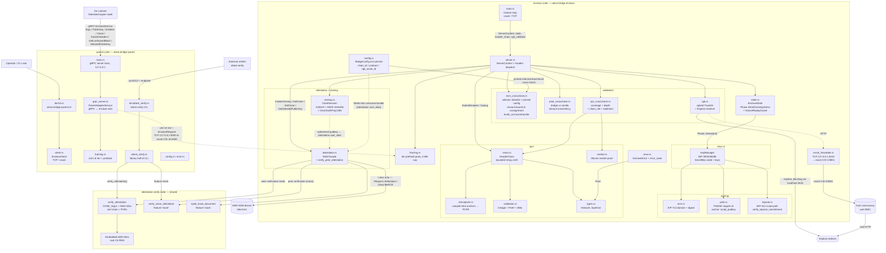

# UTEXO Bridge Enclave-Signer — Component Structure

```mermaid
flowchart TB
    %% External actors
    V[External verifier<br/>attest-verify]
    Op[Operator / CLI user]
    L[Go Listener<br/>federated-signer-node]

    %% parent crate
    subgraph PARENT [parent crate — utexo-bridge-parent]
        PMain[main.rs<br/>gRPC server tonic, 127.0.0.1]
        Grpc[grpc_server.rs<br/>ParentAdapterService<br/>gRPC ↔ enclave wire]
        PClient[client.rs<br/>EnclaveClient<br/>TCP / vsock]
        PFr[framing.rs<br/>u32 LE len + protobuf]
        PALib[attest_verify.rs<br/>library half of CLI]
        PCli[bin/cli.rs<br/>utexo-bridge-parent-cli]
        AVCli[bin/attest_verify.rs<br/>attest-verify CLI]
        PMisc[config.rs / error.rs]
    end

    %% attestation-verify shared crate
    subgraph ATTV [attestation-verify crate — shared]
        AV[verify_attestation<br/>COSE_Sign1 + AWS Nitro<br/>cert chain + PCRs]
        AVMock[verify_mock_attestation<br/>feature 'mock']
        AVBuild[build_mock_document<br/>feature 'mock']
        Root[Embedded AWS Nitro<br/>root CA PEM]
    end

    %% enclave crate
    subgraph ENC [enclave crate — utexo-bridge-enclave]
        EMain[main.rs<br/>listener loop<br/>vsock / TCP]
        ESrv[server.rs<br/>ServerContext + handler dispatch]
        EState[state.rs<br/>EnclaveState<br/>Phase Initial/Cloning/Active<br/>+ NonceReplayGuard]
        EFr[framing.rs<br/>len-prefixed proto, 4 MB cap]
        EErr[error.rs<br/>EnclaveError + error_code]
        BCfg[config.rs<br/>BridgeConfig env-pinned<br/>chain_id / contract / rgb_asset_id]
        VFwd[vsock_forwarder.rs<br/>TCP 127.0.0.1:3443<br/>→ vsock CID 3:8001]

        subgraph KEYS [keys.rs]
            KM[KeyManager<br/>BIP-39/32/84/86<br/>SecretBox seed + keys]
        end
        subgraph SIGN [signing/]
            SE[evm.rs<br/>EIP-712 domain + digest]
            SP[psbt.rs<br/>P2WSH segwit-v0<br/>anchor: script_pubkey]
            ST[taproot.rs<br/>BIP-341 script-path<br/>verify_taproot_commitment]
        end
        subgraph VAL [validation/]
            VEvm[evm_crosscheck.rs<br/>selector allowlist + pinned-config<br/>amount bound to consignment<br/>funds_out burn/transfer]
            VPsbt[psbt_crosscheck.rs<br/>bridge vs vanilla<br/>amount consistency]
            VRgb[rgb.rs<br/>rgbstd Transfer<br/>+ Esplora resolver]
            VSpv[spv_crosscheck.rs<br/>coverage + depth<br/>+ chain_net + staleness]
        end
        subgraph SPVMOD [spv/]
            SCh[chain.rs<br/>HeaderChain<br/>bounded reorg ≤100]
            SCp[checkpoint.rs<br/>compile-time anchors → PCR0]
            SMk[merkle.rs<br/>Bitcoin merkle proof]
            SVal[validation.rs<br/>linkage + PoW + nBits]
            STy[types.rs<br/>Network, SpvError]
        end
        subgraph ATTGRP [attestation + cloning]
            AF[attestation.rs<br/>NSM facade<br/>+ verify_peer_attestation]
            CL[cloning.rs<br/>CloneSession<br/>X25519 + HKDF-SHA256<br/>+ ChaCha20Poly1305]
        end
    end

    %% External
    NSM[(AWS NSM device<br/>/dev/nsm)]
    Esp{{Esplora indexer}}
    VP[(host vsock-proxy<br/>port 8001)]

    %% Wires
    L -->|"gRPC EnclaveService<br/>Sign / PublicKey / Initialize / Clone /<br/>SubmitHeaders / GetLastSavedBlock /<br/>AttestedPublicKey"| PMain
    Op --> PCli
    V -->|"--pcr0/1/2 + endpoint"| AVCli
    PCli --> PClient
    AVCli --> PALib
    PALib -->|"verify_attestation()"| AV
    PALib -->|"feature mock"| AVMock

    PMain --> Grpc
    Grpc --> PFr
    Grpc -.->|"u32 LE len + EnclaveRequest<br/>TCP 127.0.0.1:5000 or vsock CID 16:5000"| EFr

    EMain -->|"ServerContext: state, header_chain, rgb_validator"| ESrv
    ESrv --> EFr
    ESrv --> EState
    ESrv --> VEvm
    ESrv --> VPsbt
    ESrv --> VRgb
    ESrv --> VSpv
    ESrv -->|"InitiateCloning / GetClone / SetClone /<br/>GetAttestedPublicKey"| AF
    ESrv --> CL
    ESrv -->|"SubmitHeaders / lookup"| SCh

    EState -->|"Phase::Active(km)"| KM
    KM --> SE
    KM --> SP
    KM --> ST

    VRgb -->|"esplora_blocking via localhost:3443"| Esp
    VRgb -.->|"HTTP"| VFwd
    VFwd -->|"vsock CID 3:8001"| VP
    VP -->|"real HTTP"| Esp

    VSpv --> SCh
    VSpv --> SMk
    SCh --> SVal
    SCh --> SCp
    SCh --> STy

    AF -->|"Linux only — Request::Attestation /<br/>DescribePCR"| NSM
    AF -->|"peer verification (real)"| AV
    AF -->|"peer verification (mock)"| AVMock
    AF --> AVBuild
    CL -.->|"ephemeral pubkey ↔ attestation user_data"| AF
    AV --> Root

    EErr -->|"From<SpvError>"| STy

    BCfg -->|"pinned chain/contract/asset cross-check"| VEvm
    BCfg -.->|"folded into canonical bundle<br/>(attestation user_data)"| AF
```
