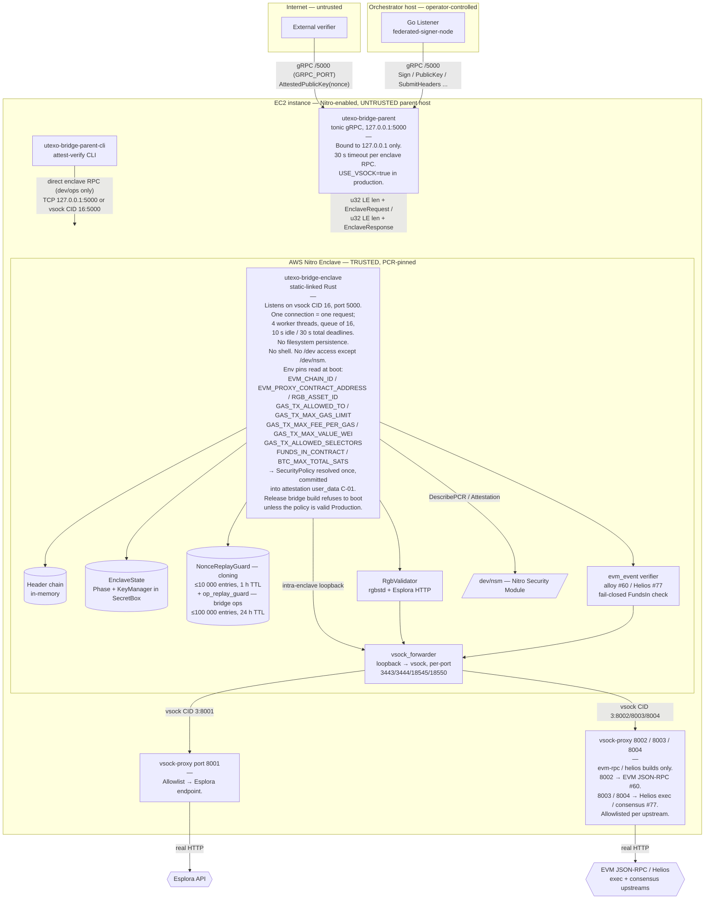

# UTEXO Bridge Enclave-Signer — Deployment

### Build / cluster notes

- Built as an **EIF** via `nitro-cli build-enclave` from `build/Dockerfile.enclave`.
  PCR0/1/2 are pinned at build time; any change in source → different PCRs → external
  verifiers reject.
- A cluster of N ≥ 2 EC2 instances share **one HD seed** via the cloning handshake.
  Each node holds an identical `KeyManager` after `Cloning → Active`.
- **Bridge-mode `signPsbt` requires the `evm-rpc` feature** (or `helios`): a build
  without it refuses bridge PSBTs, since it cannot independently verify the EVM
  `FundsIn` deposit (audit M-06 / #60, #51). Operators MUST run the matching host
  `vsock-proxy` allowlists (8002 for `evm-rpc`; 8003 + 8004 for `helios`). Env:
  `EVM_RPC_URL` / `EVM_MIN_CONFIRMATIONS`, and for Helios `HELIOS_EXECUTION_RPC`
  (selects the trustless path), `HELIOS_CHECKPOINT` (required), `HELIOS_NETWORK`
  (must match `EVM_CHAIN_ID`). See the README env table.
