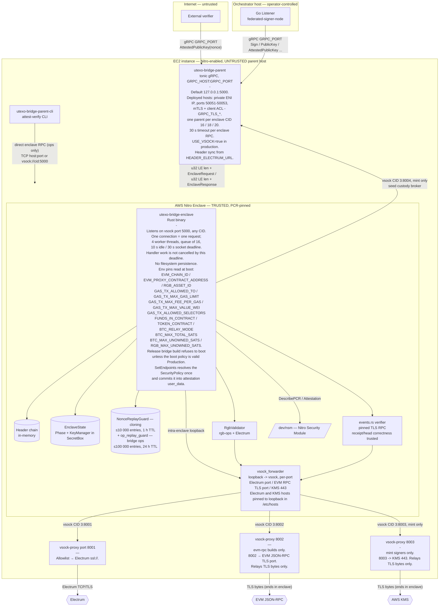

# UTEXO Bridge Enclave-Signer — Deployment

```mermaid
flowchart TB
    subgraph NET [Internet — untrusted]
        V[External verifier]
    end

    subgraph ORC [Orchestrator host — operator-controlled]
        L[Go Listener<br/>federated-signer-node]
    end

    subgraph EC2 [EC2 instance — Nitro-enabled, UNTRUSTED parent host]
        Parent[utexo-bridge-parent<br/>tonic gRPC, GRPC_HOST:GRPC_PORT<br/>-<br/>Default 127.0.0.1:5000.<br/>Deployed hosts: private ENI IP, ports 50051-50053,<br/>mTLS + client ACL - GRPC_TLS_*,<br/>one parent per enclave CID 16 / 18 / 20.<br/>30 s timeout per enclave RPC.<br/>USE_VSOCK=true in production.<br/>Header sync from HEADER_ELECTRUM_URL.]
        Cli[utexo-bridge-parent-cli<br/>attest-verify CLI]
        VP[vsock-proxy port 8001<br/>―<br/>Allowlist → Electrum ssl://.]
        VPk["vsock-proxy 8003<br/>-<br/>mint signers only.<br/>8003 -> KMS 443. Relays TLS bytes only."]
        VPe["vsock-proxy 8002<br/>―<br/>evm-rpc builds only.<br/>8002 → EVM JSON-RPC TLS port.<br/>Relays TLS bytes only."]

        subgraph ENCL [AWS Nitro Enclave — TRUSTED, PCR-pinned]
            Bin[utexo-bridge-enclave<br/>Rust binary<br/>-<br/>Listens on vsock port 5000, any CID.<br/>One connection = one request;<br/>4 worker threads, queue of 16,<br/>10 s idle / 30 s socket deadline.<br/>Handler work is not cancelled by this deadline.<br/>No filesystem persistence.<br/>Env pins read at boot:<br/>EVM_CHAIN_ID / EVM_PROXY_CONTRACT_ADDRESS / RGB_ASSET_ID<br/>GAS_TX_ALLOWED_TO / GAS_TX_MAX_GAS_LIMIT<br/>GAS_TX_MAX_FEE_PER_GAS / GAS_TX_MAX_VALUE_WEI<br/>GAS_TX_ALLOWED_SELECTORS<br/>FUNDS_IN_CONTRACT / TOKEN_CONTRACT / BTC_RELAY_MODE<br/>BTC_MAX_TOTAL_SATS<br/>BTC_MAX_UNOWNED_SATS / RGB_MAX_UNOWNED_SATS.<br/>Release bridge build refuses to boot<br/>unless the boot policy is valid Production.<br/>SetEndpoints resolves the SecurityPolicy once<br/>and commits it into attestation user_data.]
            Headers[(Header chain<br/>in-memory)]
            State[(EnclaveState<br/>Phase + KeyManager in SecretBox)]
            Replay[(NonceReplayGuard — cloning<br/>≤10 000 entries, 1 h TTL<br/>+ op_replay_guard — bridge ops<br/>≤100 000 entries, 24 h TTL)]
            Fwd["vsock_forwarder<br/>loopback -> vsock, per-port<br/>Electrum port / EVM RPC TLS port / KMS 443<br/>Electrum and KMS hosts pinned to loopback in /etc/hosts"]
            RgbVal[RgbValidator<br/>rgb-ops + Electrum]
            EvmVer[events.rs verifier<br/>pinned TLS RPC<br/>receipt/head correctness trusted]
            NSM[/dev/nsm — Nitro Security Module/]
        end
    end

    Esp{{Electrum}}
    EvmRpc{{EVM JSON-RPC}}
    Kms{{AWS KMS}}

    V -->|"gRPC GRPC_PORT<br/>AttestedPublicKey(nonce)"| Parent
    L -->|"gRPC GRPC_PORT<br/>Sign / PublicKey / AttestedPublicKey ..."| Parent
    Cli -->|"direct enclave RPC (ops only)<br/>TCP host:port or vsock://cid:5000"| ENCL

    Parent -->|"vsock CID:5000<br/>u32 LE len + EnclaveRequest /<br/>u32 LE len + EnclaveResponse"| ENCL

    Bin --> State
    Bin --> Replay
    Bin --> Headers
    Bin --> RgbVal
    Bin --> EvmVer
    Bin -->|"DescribePCR / Attestation"| NSM
    Bin -->|"intra-enclave loopback"| Fwd
    RgbVal --> Fwd
    EvmVer --> Fwd
    Fwd -->|"vsock CID 3:8001"| VP
    Fwd -->|"vsock CID 3:8002"| VPe
    Fwd -->|"vsock CID 3:8003, mint only"| VPk
    VPk -->|"TLS bytes (ends in enclave)"| Kms
    Bin -->|"vsock CID 3:8004, mint only<br/>seed custody broker"| Parent
    VP -->|"Electrum TCP/TLS"| Esp
    VPe -->|"TLS bytes (ends in enclave)"| EvmRpc
```

### Build / cluster notes

- Built as an **EIF** via `nitro-cli build-enclave`. Production images:
  `build/Dockerfile.enclave.mint` (mint signer) and `.burn` (burn signer).
  Other images: `Dockerfile.enclave` (rgb-swap + ccd) and `.rgb` (rgb-swap),
  both the retired swap flow, and `.ccd`. The EIF build reports PCR0/1/2.
  Verifiers must pin approved values. Image changes can require new measurements.
  `build-eif.yml` publishes EIF + `PCR.json` + `SHA256SUMS` to S3 under the git
  sha; `deploy/deploy-host.sh` verifies both before and after start.
- Without `kms-persistence`, cloned enclaves share **one HD seed** via the
  cloning handshake (`utexo-bridge-parent-cli clone`). Each node holds an identical `KeyManager`
  after `Cloning → Active`. Keys live only in memory; a restart needs re-init or
  re-clone. Mint signers enable `kms-persistence` and recover the saved encrypted
  seed instead; peer cloning is disabled. See
  [KMS seed persistence](../kms-persistence.md).
- **Bridge signing requires the `evm-rpc` feature** (both production images
  have it through `bfa-validation`): the mint signer verifies the EVM
  `FundsIn` deposit, the burn signer the mint-ancestry locks. A build without
  it refuses bridge PSBTs. Operators MUST run the host `vsock-proxy` allowlist
  on 8002. Receipt checks require the head selected by `EVM_FINALITY_TAG`
  (default `safe`) and canonical block-hash agreement. An unsupported tag
  refuses signing. See the README env table.
- **Endpoints at launch**: `utexo-enclave-ctl.sh start` sends `set-endpoints`
  once to each fresh enclave (Electrum URL, EVM RPC host, CA, TLS port, and
  the KMS pin on mint signers). Until then the enclave signs nothing.

Clones provide replicas of one signing identity. Independent quorum members
need independently initialized seeds.
