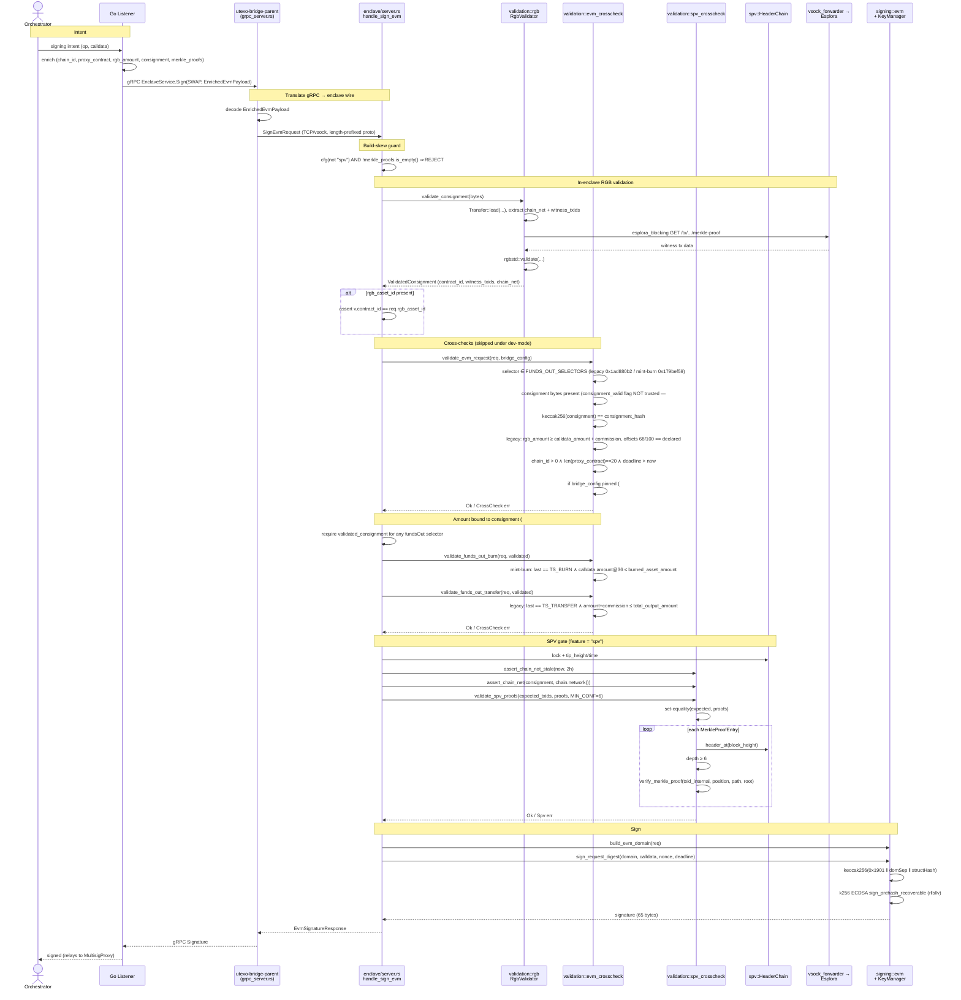

# Sign EVM (RGB → EVM unlock) — full path with cross-checks

```mermaid
sequenceDiagram
    actor Orc as Orchestrator
    participant Listener as Go Listener
    participant Parent as utexo-bridge-parent<br/>(grpc_server.rs)
    participant Srv as enclave/server.rs<br/>handle_sign_evm
    participant Rgb as validation::rgb<br/>RgbValidator
    participant Evm as validation::evm_crosscheck
    participant Spv as validation::spv_crosscheck
    participant Chain as spv::HeaderChain
    participant Esplora as vsock_forwarder →<br/>Esplora
    participant Sign as signing::evm<br/>+ KeyManager

    Note over Orc,Listener: Intent
    Orc->>Listener: signing intent (op, calldata)
    Listener->>Listener: enrich (chain_id, proxy_contract, rgb_amount, consignment, merkle_proofs)
    Listener->>Parent: gRPC EnclaveService.Sign(SWAP, EnrichedEvmPayload)

    Note over Parent,Srv: Translate gRPC → enclave wire
    Parent->>Parent: decode EnrichedEvmPayload
    Parent->>Srv: SignEvmRequest (TCP/vsock, length-prefixed proto)

    Note over Srv: Build-skew guard
    Srv->>Srv: cfg(not "spv") AND !merkle_proofs.is_empty() ⇒ REJECT

    Note over Srv,Esplora: In-enclave RGB validation
    Srv->>Rgb: validate_consignment(bytes)
    Rgb->>Rgb: Transfer::load(...), extract chain_net + witness_txids
    Rgb->>Esplora: esplora_blocking GET /tx/.../merkle-proof
    Esplora-->>Rgb: witness tx data
    Rgb->>Rgb: rgbstd::validate(...)
    Rgb-->>Srv: ValidatedConsignment (contract_id, witness_txids, chain_net)
    alt rgb_asset_id present
        Srv->>Srv: assert v.contract_id == req.rgb_asset_id
    end

    Note over Srv,Evm: Cross-checks (skipped under dev-mode)
    Srv->>Evm: validate_evm_request(req, bridge_config)
    Evm->>Evm: selector ∈ FUNDS_OUT_SELECTORS (legacy 0x1ad880b2 / mint-burn 0x179bef59)
    Evm->>Evm: consignment bytes present (consignment_valid flag NOT trusted — #47)
    Evm->>Evm: keccak256(consignment) == consignment_hash
    Evm->>Evm: legacy: rgb_amount ≥ calldata_amount + commission, offsets 68/100 == declared
    Evm->>Evm: chain_id > 0 ∧ len(proxy_contract)==20 ∧ deadline > now
    Evm->>Evm: if bridge_config pinned (#43): chain_id/proxy_contract/rgb_asset_id == env pins
    Evm-->>Srv: Ok / CrossCheck err

    Note over Srv,Evm: Amount bound to consignment (#44/#47)
    Srv->>Srv: require validated_consignment for any fundsOut selector
    Srv->>Evm: validate_funds_out_burn(req, validated)
    Evm->>Evm: mint-burn: last == TS_BURN ∧ calldata amount@36 ≤ burned_asset_amount
    Srv->>Evm: validate_funds_out_transfer(req, validated)
    Evm->>Evm: legacy: last == TS_TRANSFER ∧ amount+commission ≤ total_output_amount
    Evm-->>Srv: Ok / CrossCheck err

    Note over Srv,Chain: SPV gate (feature = "spv")
    Srv->>Chain: lock + tip_height/time
    Srv->>Spv: assert_chain_not_stale(now, 2h)
    Srv->>Spv: assert_chain_net(consignment, chain.network())
    Srv->>Spv: validate_spv_proofs(expected_txids, proofs, MIN_CONF=6)
    Spv->>Spv: set-equality(expected, proofs)
    loop each MerkleProofEntry
        Spv->>Chain: header_at(block_height)
        Spv->>Spv: depth ≥ 6
        Spv->>Spv: verify_merkle_proof(txid_internal, position, path, root)
    end
    Spv-->>Srv: Ok / Spv err

    Note over Srv,Sign: Sign
    Srv->>Sign: build_evm_domain(req)
    Srv->>Sign: sign_request_digest(domain, calldata, nonce, deadline)
    Sign->>Sign: keccak256(0x1901 ‖ domSep ‖ structHash)
    Sign->>Sign: k256 ECDSA sign_prehash_recoverable (r‖s‖v)
    Sign-->>Srv: signature (65 bytes)

    Srv-->>Parent: EvmSignatureResponse
    Parent-->>Listener: gRPC Signature
    Listener-->>Orc: signed (relays to MultisigProxy)
```
