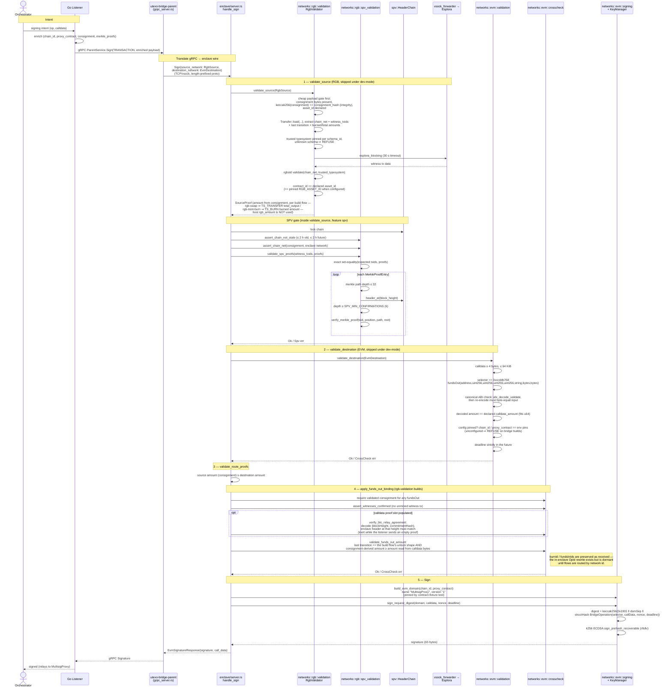

# Sign (RGB → EVM unlock, `fundsOut`) — full path with cross-checks

The on-chain quorum (`MultisigProxy` M-of-N) and nonce consumption are the
authoritative replay guards for this direction; the enclave commits `nonce`
and `deadline` into the digest but keeps no fundsOut nonce state.
