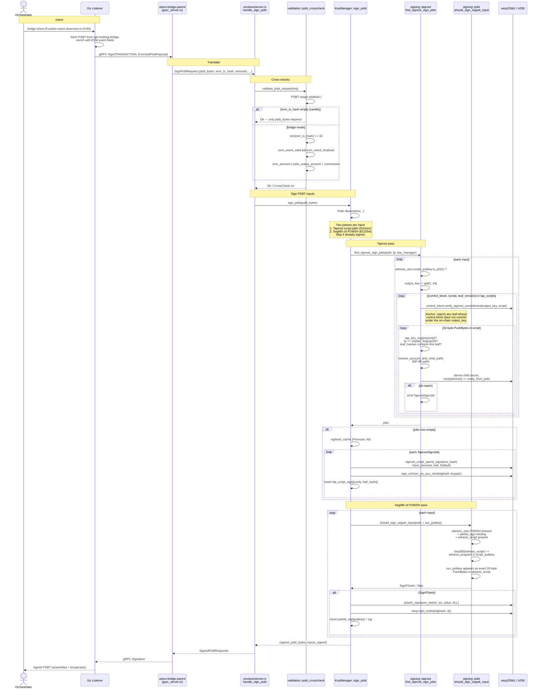

# Sign PSBT (EVM → RGB lock) — taproot + segwit-v0, anchored authorisation

```mermaid
sequenceDiagram
    actor Orc as Orchestrator
    participant Listener as Go Listener
    participant Parent as utexo-bridge-parent<br/>(grpc_server.rs)
    participant Srv as enclave/server.rs<br/>handle_sign_psbt
    participant PsbtCx as validation::psbt_crosscheck
    participant Km as KeyManager::sign_psbt
    participant Tap as signing::taproot<br/>find_taproot_sign_jobs
    participant Sw as signing::psbt<br/>should_sign_segwit_input
    participant Crypto as secp256k1 / k256

    Note over Orc,Listener: Intent
    Orc->>Listener: bridge intent (FundsIn event observed on EVM)
    Listener->>Listener: fetch PSBT from rgb-multisig-bridge,<br/>enrich with EVM event fields
    Listener->>Parent: gRPC Sign(TRANSACTION, EnrichedPsbtPayload)

    Note over Parent,Srv: Translate
    Parent->>Srv: SignPsbtRequest (psbt_bytes, evm_tx_hash, amounts, ...)

    Note over Srv,PsbtCx: Cross-checks
    Srv->>PsbtCx: validate_psbt_request(req)
    PsbtCx->>PsbtCx: PSBT shape whitelist (#40):<br/>psbt_bytes non-empty,<br/>Psbt::deserialize ok,<br/>unsigned tx has ≥ 1 input
    alt evm_tx_hash empty (vanilla)
        PsbtCx-->>Srv: Ok — only psbt_bytes required
    else bridge mode
        PsbtCx->>PsbtCx: len(evm_tx_hash) == 32
        PsbtCx->>PsbtCx: evm_event_valid && evm_event_finalized
        PsbtCx->>PsbtCx: evm_amount ≥ psbt_output_amount + commission
    end
    PsbtCx-->>Srv: Ok / CrossCheck err

    Note over Srv,Km: Sign PSBT inputs
    Srv->>Km: sign_psbt(psbt_bytes)
    Km->>Km: Psbt::deserialize(...)
    Note over Km: Two passes per input:<br/>1. Taproot script-path (Schnorr)<br/>2. SegWit v0 P2WSH (ECDSA)<br/>Skip if already signed.

    Note over Km,Tap: Taproot pass
    Km->>Tap: find_taproot_sign_jobs(psbt, fp, key_manager)
    loop each input
        Tap->>Tap: witness_utxo.script_pubkey.is_p2tr() ?
        Tap->>Tap: output_key := spk[2..34]
        loop (control_block, (script, leaf_version)) in tap_scripts
            Tap->>Crypto: control_block.verify_taproot_commitment(output_key, script)
            Note right of Tap: Anchor: rejects any leaf whose<br/>control block does not commit<br/>under the on-chain output_key.
            loop 32-byte PushBytes in script
                Tap->>Tap: tap_key_origins[xonly]?<br/>fp == master_fingerprint?<br/>leaf_hashes contains this leaf?
                Tap->>Tap: resolve_account_and_child_path(<br/>BIP-86 path)
                Tap->>Crypto: derive child secret,<br/>xonly(derived) == xonly_from_psbt
                alt all match
                    Tap->>Tap: emit TaprootSignJob
                end
            end
        end
    end
    Tap-->>Km: jobs

    alt jobs non-empty
        Km->>Km: sighash_cache (Prevouts::All)
        loop each TaprootSignJob
            Km->>Crypto: taproot_script_spend_signature_hash(<br/>input, prevouts, leaf, Default)
            Km->>Crypto: sign_schnorr_no_aux_rand(sighash, keypair)
            Km->>Km: insert tap_script_sigs[(xonly, leaf_hash)]
        end
    end

    Note over Km,Sw: SegWit v0 P2WSH pass
    loop each input
        Km->>Sw: should_sign_segwit_input(psbt, i, our_pubkey)
        Sw->>Sw: witness_utxo P2WSH present<br/>+ partial_sigs missing<br/>+ witness_script present
        Sw->>Sw: sha256(witness_script) ==<br/>witness_program in script_pubkey
        Sw->>Sw: our_pubkey appears as exact 33-byte<br/>PushBytes in witness_script
        Sw-->>Km: SignP2wsh / Skip
        alt SignP2wsh
            Km->>Crypto: p2wsh_signature_hash(i, ws, value, ALL)
            Km->>Crypto: secp.sign_ecdsa(sighash, sk)
            Km->>Km: insert partial_sigs[pubkey] = sig
        end
    end

    Km-->>Srv: (signed_psbt_bytes, inputs_signed)
    Srv-->>Parent: SignedPsbtResponse
    Parent-->>Listener: gRPC Signature
    Listener-->>Orc: signed PSBT (assembles + broadcasts)
```
