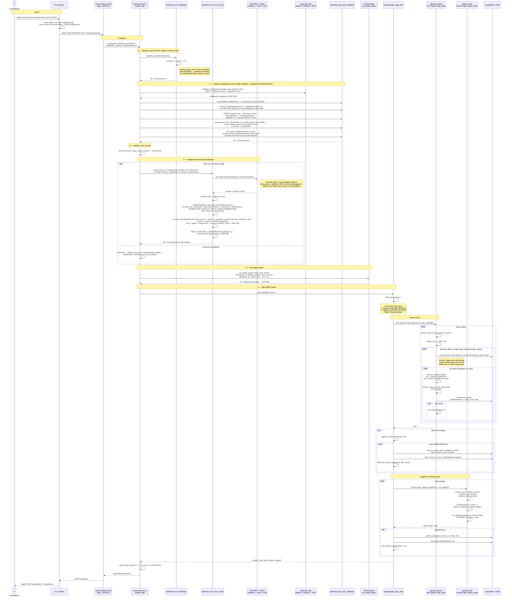

# Sign (EVM → RGB, bridge PSBT) — taproot + segwit-v0, anchored authorisation

Plain-BTC (non-bridge) PSBTs do **not** go through this path anymore: they use
the separate `SignBtc` request, gated by the attested `allow_vanilla_psbt`
policy, the output self-ownership rule (an output must repay a script the
transaction is already spending, with `BTC_MAX_UNOWNED_SATS` budgeting those
that do not), and the `BTC_MAX_TOTAL_SATS` cap, with signing scoped to the
vanilla BIP-86 account only.

The bridge path below always requires the EVM deposit hash **and** the RGB
consignment, is scoped to the colored account, and bounds Bitcoin outputs it
cannot prove by `RGB_MAX_UNOWNED_SATS` -- every other bind on this path is
denominated in RGB asset units and says nothing about sats.

## FundsIn verification predicate (`networks::evm::evm_event`)

Bridge PSBT signing releases RGB against an EVM deposit. The listener-supplied
`event_valid` / `event_finalized` booleans are **not trusted**; the enclave establishes validity + finality itself, fail-closed:

1. **Receipt exists** for `evm_tx_hash` — `None` (not mined / host withheld) → refuse.
2. **Receipt status == success** — a reverted tx emits no real deposit event.
3. **Unique** deposit event from the **pinned** `FUNDS_IN_CONTRACT` (falls back
   to `EVM_PROXY_CONTRACT_ADDRESS` — address from config, never the request).
   `BridgeFundsIn` is preferred; a same-tx `FundsIn` + `BridgeFundsIn` pair is
   one deposit. Two real deposits in one tx are ambiguous → refuse.
4. **Field binding** — on-chain `operationId` == `funds_in_operation_id`
   (the bridge transfer id, **not** the hub's `operation_idx`). A
   `BridgeFundsIn` event additionally chain-binds gross `amount` and
   `tokenCommission` (`net == gross − commission`); the plain `FundsIn`
   fallback binds only `operationId` and the net amount, leaving the
   commission split listener-supplied. A `uint256` exceeding `u64` is
   rejected, not truncated.
5. **Confirmation depth** — `head − receipt.block` ≥ `EVM_MIN_CONFIRMATIONS`
   (default 12); a receipt block above head (reorg) → refuse.

**Provider selection (build/runtime):**
- No `evm-rpc` feature → bridge PSBT signing is **refused** (deposit unverifiable).
- `evm-rpc` → raw alloy JSON-RPC over the loopback vsock forwarder; responses are
  **host-relayed evidence**, verified fail-closed but not trustless.
- `helios` + `HELIOS_EXECUTION_RPC` set → the Helios light client verifies the
  execution/consensus RPCs against an operator-pinned checkpoint **inside the
  TEE** (trustless); `HELIOS_NETWORK` must be consistent with the pinned
  `EVM_CHAIN_ID`. A Helios init/sync failure fails closed — it never downgrades
  to the raw path. The selected source is part of the attested security policy
.

See [`10-signing-gate.md`](10-signing-gate.md) for the `fundsOut` (RGB → EVM) direction.
