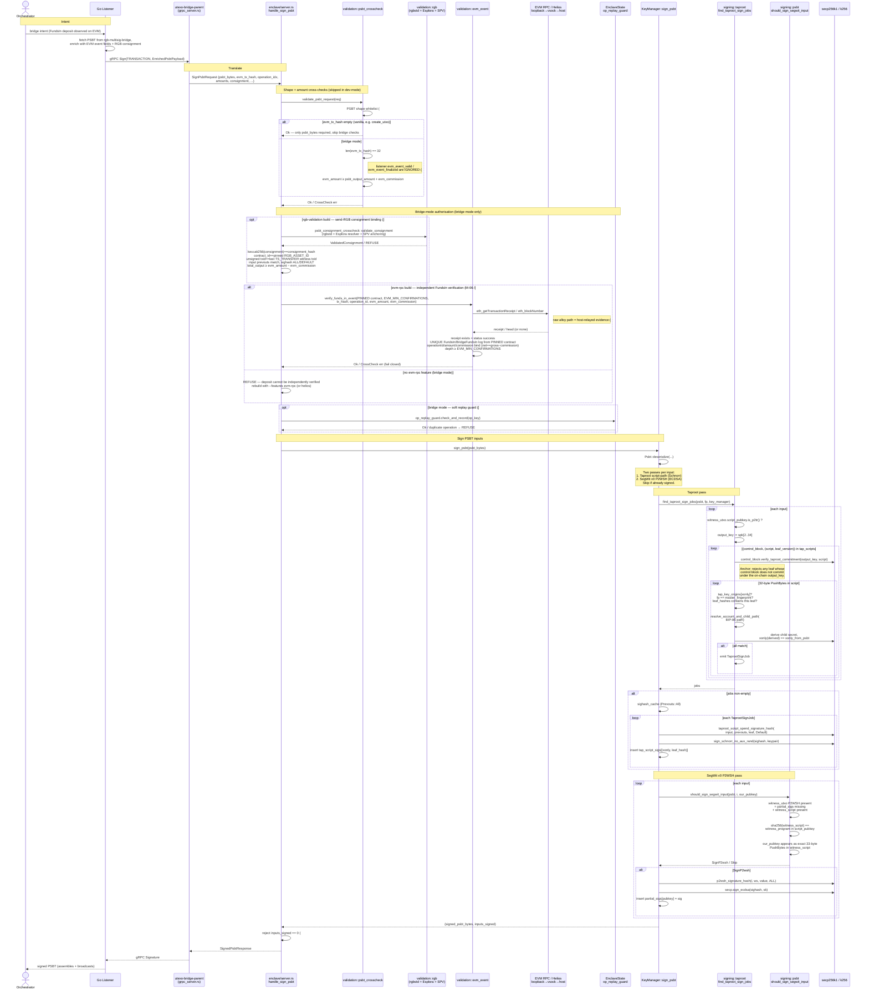

# Sign PSBT (EVM → RGB lock) — taproot + segwit-v0, anchored authorisation



## FundsIn verification predicate (`validation::evm_event`, #60 / #77)

Bridge-mode `signPsbt` releases RGB against an EVM deposit. The listener-supplied
`evm_event_valid` / `evm_event_finalized` booleans are **no longer trusted** (audit
M-06 / #51); the enclave establishes validity + finality itself, fail-closed:

1. **Receipt exists** for `evm_tx_hash` — `None` (not mined / host withheld) → refuse.
2. **Receipt status == success** — a reverted tx emits no real `FundsIn`.
3. **Unique** `FundsIn` / `BridgeFundsIn` log from the **pinned** `BRIDGE_CONTRACT`
   (address from config, never the request); multiple matches are ambiguous → refuse.
4. **Field binding** — decoded `operationId` (== `operation_idx`), gross `amount`
   (== `evm_amount`), `tokenCommission` (== `evm_commission`), and the internal
   `net == gross − commission`. A `uint256` exceeding `u64` is rejected, not truncated.
5. **Confirmation depth** — `head − receipt.block` ≥ `EVM_MIN_CONFIRMATIONS`
   (default 12); a receipt block above head (reorg) → refuse.

**Provider selection (build/runtime):**
- No `evm-rpc` feature → bridge-mode `signPsbt` is **refused** (deposit unverifiable).
- `evm-rpc` → raw alloy JSON-RPC over the loopback vsock forwarder; responses are
  **host-relayed evidence**, verified fail-closed but not trustless.
- `helios` + `HELIOS_EXECUTION_RPC` set → the a16z Helios light client verifies the
  execution/consensus RPCs against a pinned checkpoint **inside the TEE** (trustless);
  `HELIOS_NETWORK` must be consistent with the pinned `EVM_CHAIN_ID`.

See [`10-signing-gate.md`](10-signing-gate.md) for the `fundsOut` (RGB → EVM) direction.
```
