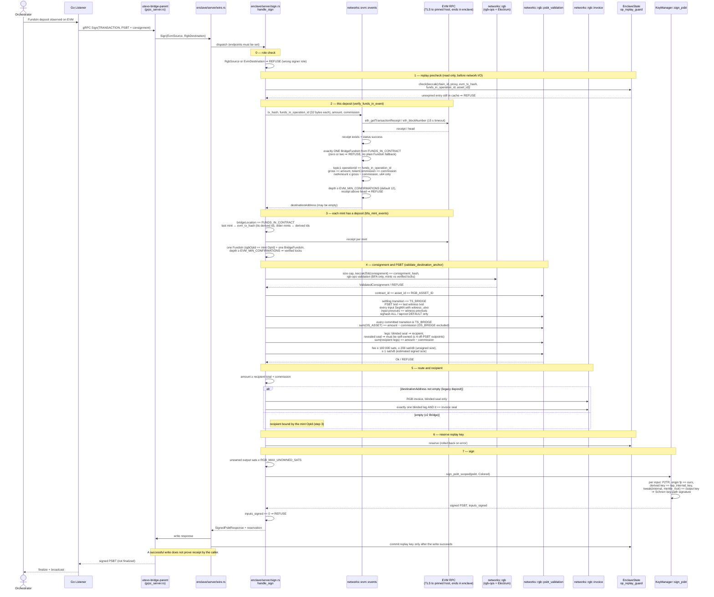

# Sign (EVM → RGB, mint PSBT) — mint signer

The mint signer path, in code order. Step-by-step text:
[mint flow](../mint-flow.md).

The request must have the EVM deposit hash **and** the RGB consignment. The
mint signer uses Taproot key-path signatures from the colored BIP-86 account. Bitcoin
outputs that the enclave cannot prove it owns are limited by
`RGB_MAX_UNOWNED_SATS`.

Plain-BTC PSBTs do not use this path. They use the separate `SignBtc` request
(vanilla account, attested `allow_vanilla_psbt`, `BTC_MAX_TOTAL_SATS`,
`BTC_MAX_UNOWNED_SATS`).

```mermaid
sequenceDiagram
    actor Orc as Orchestrator
    participant Listener as Go Listener
    participant Parent as utexo-bridge-parent<br/>(grpc_server.rs)
    participant Wire as enclave/server/wire.rs
    participant Srv as enclave/server/sign.rs<br/>handle_sign
    participant Evt as networks::evm::events
    participant Rpc as EVM RPC<br/>(TLS to pinned host, ends in enclave)
    participant Rgb as networks::rgb<br/>(rgb-ops + Electrum)
    participant Anchor as networks::rgb::psbt_validation
    participant Inv as networks::rgb::invoice
    participant State as EnclaveState<br/>op_replay_guard
    participant Km as KeyManager::sign_psbt

    Orc->>Listener: FundsIn deposit observed on EVM
    Listener->>Parent: gRPC Sign(TRANSACTION, PSBT + consignment)
    Parent->>Wire: Sign{EvmSource, RgbDestination}
    Wire->>Srv: dispatch (endpoints must be set)

    Note over Srv: 0 — role check
    Srv->>Srv: RgbSource or EvmDestination ⇒ REFUSE (wrong signer role)

    Note over Srv,State: 1 — replay precheck (read only, before network I/O)
    Srv->>State: check(keccak(chain_id, proxy, evm_tx_hash,<br/>funds_in_operation_id, asset_id))
    State-->>Srv: unexpired entry still in cache ⇒ REFUSE

    Note over Srv,Rpc: 2 — this deposit (verify_funds_in_event)
    Srv->>Evt: tx_hash, funds_in_operation_id (32 bytes each), amount, commission
    Evt->>Rpc: eth_getTransactionReceipt / eth_blockNumber (15 s timeout)
    Rpc-->>Evt: receipt / head
    Evt->>Evt: receipt exists + status success
    Evt->>Evt: exactly ONE BridgeFundsIn from FUNDS_IN_CONTRACT<br/>(zero or two ⇒ REFUSE, no plain FundsIn fallback)
    Evt->>Evt: topic1 operationId == funds_in_operation_id<br/>gross == amount, tokenCommission == commission<br/>netAmount ≤ gross − commission, u64 only
    Evt->>Evt: depth ≥ EVM_MIN_CONFIRMATIONS (default 12),<br/>receipt above head ⇒ REFUSE
    Evt-->>Srv: destinationAddress (may be empty)

    Note over Srv,Rpc: 3 — each mint has a deposit (bfa_mint_events)
    Srv->>Srv: bridgeLocation == FUNDS_IN_CONTRACT<br/>last mint ↔ evm_tx_hash (its derived id), older mints ↔ derived ids
    Srv->>Rpc: receipt per mint
    Srv->>Srv: one FundsIn (rgbOpId == mint OpId) + one BridgeFundsIn,<br/>depth ≥ EVM_MIN_CONFIRMATIONS ⇒ verified locks

    Note over Srv,Anchor: 4 — consignment and PSBT (validate_destination_anchor)
    Srv->>Rgb: size cap, keccak256(consignment) == consignment_hash,<br/>rgb-ops validation (BFA only, mints vs verified locks)
    Rgb-->>Srv: ValidatedConsignment / REFUSE
    Srv->>Anchor: contract_id == asset_id == RGB_ASSET_ID
    Srv->>Anchor: settling transition == TS_BRIDGE<br/>PSBT txid == last witness txid<br/>every input SegWit with witness_utxo<br/>input prevouts == witness prevouts<br/>sighash ALL / taproot DEFAULT only
    Srv->>Anchor: every committed transition is TS_BRIDGE<br/>sum(OS_ASSET) == amount − commission (OS_BRIDGE excluded)
    Srv->>Anchor: legs: blinded seal ⇒ recipient,<br/>revealed seal ⇒ must be self-owned (≤ 4 off-PSBT outpoints)<br/>sum(recipient legs) == amount − commission
    Srv->>Anchor: fee ≤ 100 000 sats, ≤ 200 sat/vB (unsigned size),<br/>≥ 1 sat/vB (estimated signed size)
    Anchor-->>Srv: Ok / REFUSE

    Note over Srv,Inv: 5 — route and recipient
    Srv->>Srv: amount ≥ recipient total + commission
    alt destinationAddress not empty (legacy deposit)
        Srv->>Inv: RGB invoice, blinded seal only
        Srv->>Inv: exactly one blinded leg AND it == invoice seal
    else empty (v2 Bridge)
        Note right of Srv: recipient bound by the mint OpId (step 3)
    end

    Note over Srv,State: 6 — reserve replay key
    Srv->>State: reserve (rolled back on error)

    Note over Srv,Km: 7 — sign
    Srv->>Srv: unowned output sats ≤ RGB_MAX_UNOWNED_SATS
    Srv->>Km: sign_psbt_scoped(psbt, Colored)
    Km->>Km: per input: P2TR, origin fp == ours,<br/>derived key == tap_internal_key,<br/>tweak(internal, merkle_root) == output key<br/>⇒ Schnorr key-path signature
    Km-->>Srv: signed PSBT, inputs_signed
    Srv->>Srv: inputs_signed == 0 ⇒ REFUSE
    Srv-->>Wire: SignedPsbtResponse + reservation
    Wire->>Parent: write response
    Wire->>State: commit replay key only after the write succeeds
    Note over Wire,Parent: A successful write does not prove receipt by the caller.
    Parent-->>Listener: signed PSBT (not finalized)
    Listener-->>Orc: finalize + broadcast
```

The witness transaction is being signed now. It does not need to be mined.
The mint path does no SPV check. The replay cache is in memory and per
enclave. It is not a durable deposit ledger.

See [the spec](../tee-spec.md#72-evm-lock---rgb-bridge-psbt) for the deposit
rules.
