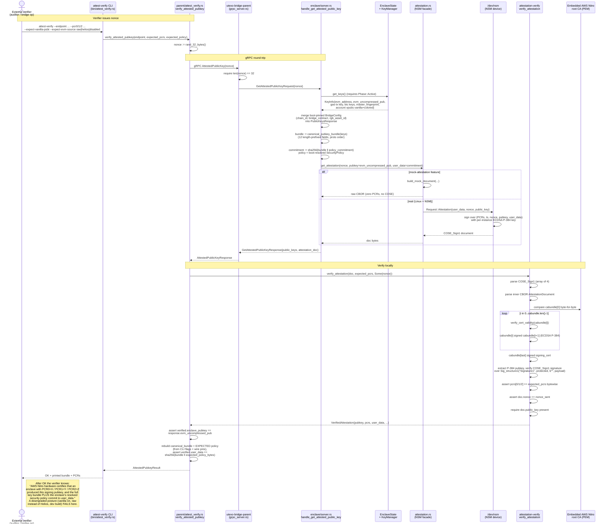

# Attested public key — external verifier ↔ enclave (TEE binding proof)

```mermaid
sequenceDiagram
    actor V as External verifier<br/>(auditor / bridge op)
    participant Cli as attest-verify CLI<br/>(bin/attest_verify.rs)
    participant Lib as parent/attest_verify.rs<br/>verify_attested_pubkey
    participant Parent as utexo-bridge-parent<br/>(grpc_server.rs)
    participant Srv as enclave/server.rs<br/>handle_get_attested_public_key
    participant State as EnclaveState<br/>+ KeyManager
    participant Att as attestation.rs<br/>(NSM facade)
    participant NSM as /dev/nsm<br/>(NSM device)
    participant Verify as attestation-verify<br/>verify_attestation
    participant RootCa as Embedded AWS Nitro<br/>root CA (PEM)

    Note over V,Lib: Verifier issues nonce
    V->>Cli: attest-verify --endpoint ... --pcr0/1/2 ...<br/>--expect-vanilla-psbt --expect-evm-source raw|helios|disabled
    Cli->>Lib: verify_attested_pubkey(endpoint, expected_pcrs, expected_policy)
    Lib->>Lib: nonce := rand_32_bytes()

    Note over Lib,Srv: gRPC round-trip
    Lib->>Parent: gRPC AttestedPublicKey(nonce)
    Parent->>Parent: require len(nonce) == 32
    Parent->>Srv: GetAttestedPublicKeyRequest{nonce}

    Srv->>State: get_keys() (requires Phase::Active)
    State-->>Srv: KeyInfo{evm_address, evm_uncompressed_pub,<br/>gas-tx key, btc keys, master_fingerprint,<br/>account xpubs vanilla+colored}

    Srv->>Srv: merge boot-pinned BridgeConfig<br/>(chain_id, bridge_contract, rgb_asset_id)<br/>into PublicKeysResponse
    Srv->>Srv: bundle := canonical_pubkey_bundle(keys)<br/>(12 length-prefixed fields, proto order)
    Srv->>Srv: commitment := sha256(bundle ‖ policy_commitment)<br/>policy = boot-resolved SecurityPolicy

    Srv->>Att: get_attestation(nonce, pubkey=evm_uncompressed_pub, user_data=commitment)
    alt mock-attestation feature
        Att->>Att: build_mock_document(...)
        Att-->>Srv: raw CBOR (zero PCRs, no COSE)
    else real (Linux + NSM)
        Att->>NSM: Request::Attestation{user_data, nonce, public_key}
        NSM->>NSM: sign over (PCRs, ts, nonce, pubkey, user_data)<br/>with per-instance ECDSA P-384 key
        NSM-->>Att: COSE_Sign1 document
        Att-->>Srv: doc bytes
    end

    Srv-->>Parent: GetAttestedPublicKeyResponse{public_keys, attestation_doc}
    Parent-->>Lib: AttestedPublicKeyResponse

    Note over Lib,RootCa: Verify locally
    Lib->>Verify: verify_attestation(doc, expected_pcrs, Some(nonce))
    Verify->>Verify: parse COSE_Sign1 (array of 4)
    Verify->>Verify: parse inner CBOR AttestationDocument
    Verify->>RootCa: compare cabundle[0] byte-for-byte
    loop i in 0..cabundle.len()-1
        Verify->>Verify: verify_cert_validity(cabundle[i])
        Verify->>Verify: cabundle[i] signed cabundle[i+1] (ECDSA P-384)
    end
    Verify->>Verify: cabundle[last] signed signing_cert
    Verify->>Verify: extract P-384 pubkey, verify COSE_Sign1 signature<br/>over Sig_structure1("Signature1", protected, b"", payload)
    Verify->>Verify: assert pcrs[0/1/2] == expected_pcrs bytewise
    Verify->>Verify: assert doc.nonce == nonce_sent
    Verify->>Verify: require doc.public_key present
    Verify-->>Lib: VerifiedAttestation{pubkey, pcrs, user_data, ...}

    Lib->>Lib: assert verified.enclave_pubkey ==<br/>response.evm_uncompressed_pub
    Lib->>Lib: rebuild canonical_bundle + EXPECTED policy<br/>(from CLI flags + wire pins),<br/>assert verified.user_data ==<br/>sha256(bundle ‖ expected_policy_bytes)

    Lib-->>Cli: AttestedPubkeyResult
    Cli-->>V: OK + printed bundle + PCRs

    Note right of V: After OK the verifier knows:<br/>"AWS Nitro hardware certifies that an<br/>enclave with PCR0=X / PCR1=Y / PCR2=Z<br/>produced this signing pubkey, and the full<br/>key bundle PLUS the enclave's resolved<br/>security policy commit to user_data."<br/>A downgraded posture (vanilla on, raw<br/>instead of Helios, dev build) FAILS here.
```
