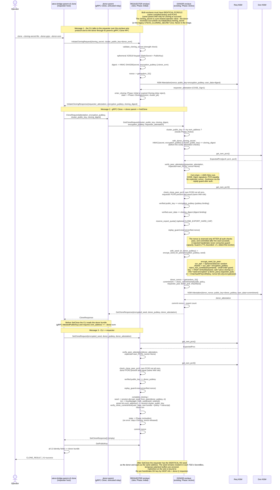

# Enclave-to-enclave seed cloning - three-message handshake

This lifecycle applies to burn signers and other builds without `kms-persistence`.
Mint signers use [KMS seed persistence](../kms-persistence.md) instead.

