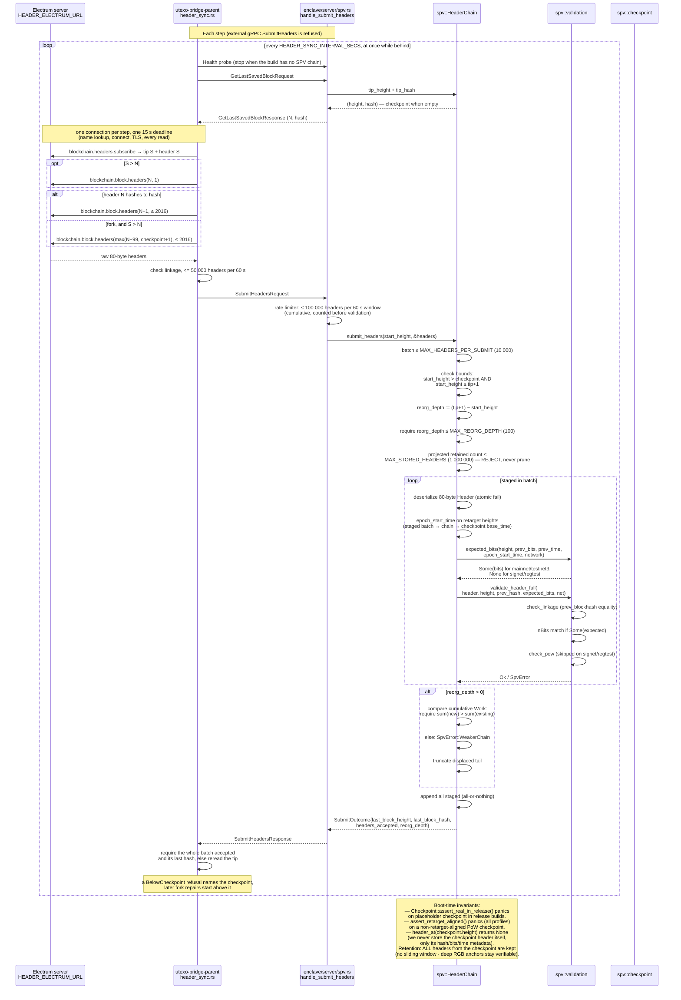

# SubmitHeaders — parent-driven SPV chain sync

```mermaid
sequenceDiagram
    participant Electrum as Electrum server<br/>HEADER_ELECTRUM_URL
    participant Parent as utexo-bridge-parent<br/>header_sync.rs
    participant Srv as enclave/server/spv.rs<br/>handle_submit_headers
    participant Chain as spv::HeaderChain
    participant Val as spv::validation
    participant Cp as spv::checkpoint

    Note over Parent,Srv: Each step (external gRPC SubmitHeaders is refused)
    loop every HEADER_SYNC_INTERVAL_SECS, at once while behind
        Parent->>Srv: Health probe (stop when the build has no SPV chain)
        Parent->>Srv: GetLastSavedBlockRequest
        Srv->>Chain: tip_height + tip_hash
        Chain-->>Srv: (height, hash) — checkpoint when empty
        Srv-->>Parent: GetLastSavedBlockResponse (N, hash)
        Note over Parent,Electrum: one connection per step, one 15 s deadline<br/>(name lookup, connect, TLS, every read)
        Parent->>Electrum: blockchain.headers.subscribe → tip S + header S
        opt S > N
            Parent->>Electrum: blockchain.block.headers(N, 1)
        end
        alt header N hashes to hash
            Parent->>Electrum: blockchain.block.headers(N+1, ≤ 2016)
        else fork, and S > N
            Parent->>Electrum: blockchain.block.headers(max(N−99, checkpoint+1), ≤ 2016)
        end
        Electrum-->>Parent: raw 80-byte headers
        Parent->>Parent: check linkage, <= 50 000 headers per 60 s
        Parent->>Srv: SubmitHeadersRequest

        Srv->>Srv: rate limiter: ≤ 100 000 headers per 60 s window<br/>(cumulative, counted before validation)
        Srv->>Chain: submit_headers(start_height, &headers)
        Chain->>Chain: batch ≤ MAX_HEADERS_PER_SUBMIT (10 000)
        Chain->>Chain: check bounds:<br/>start_height > checkpoint AND<br/>start_height ≤ tip+1
        Chain->>Chain: reorg_depth := (tip+1) − start_height
        Chain->>Chain: require reorg_depth ≤ MAX_REORG_DEPTH (100)
        Chain->>Chain: projected retained count ≤<br/>MAX_STORED_HEADERS (1 000 000) — REJECT, never prune

        loop staged in batch
            Chain->>Chain: deserialize 80-byte Header (atomic fail)
            Chain->>Chain: epoch_start_time on retarget heights<br/>(staged batch → chain → checkpoint base_time)
            Chain->>Val: expected_bits(height, prev_bits, prev_time,<br/>epoch_start_time, network)
            Val-->>Chain: Some(bits) for mainnet/testnet3,<br/>None for signet/regtest
            Chain->>Val: validate_header_full(<br/>header, height, prev_hash, expected_bits, net)
            Val->>Val: check_linkage (prev_blockhash equality)
            Val->>Val: nBits match if Some(expected)
            Val->>Val: check_pow (skipped on signet/regtest)
            Val-->>Chain: Ok / SpvError
        end

        alt reorg_depth > 0
            Chain->>Chain: compare cumulative Work:<br/>require sum(new) > sum(existing)
            Chain->>Chain: else: SpvError::WeakerChain
            Chain->>Chain: truncate displaced tail
        end

        Chain->>Chain: append all staged (all-or-nothing)
        Chain-->>Srv: SubmitOutcome{last_block_height, last_block_hash,<br/>headers_accepted, reorg_depth}

        Srv-->>Parent: SubmitHeadersResponse
        Parent->>Parent: require the whole batch accepted<br/>and its last hash, else reread the tip
        Note over Parent: a BelowCheckpoint refusal names the checkpoint,<br/>later fork repairs start above it
    end

    Note over Chain: Boot-time invariants:<br/>— Checkpoint::assert_real_in_release() panics<br/> on placeholder checkpoint in release builds.<br/>— assert_retarget_aligned() panics (all profiles)<br/> on a non-retarget-aligned PoW checkpoint.<br/>— header_at(checkpoint.height) returns None<br/> (we never store the checkpoint header itself,<br/> only its hash/bits/time metadata).<br/>Retention: ALL headers from the checkpoint are kept<br/>(no sliding window - deep RGB anchors stay verifiable).
```
