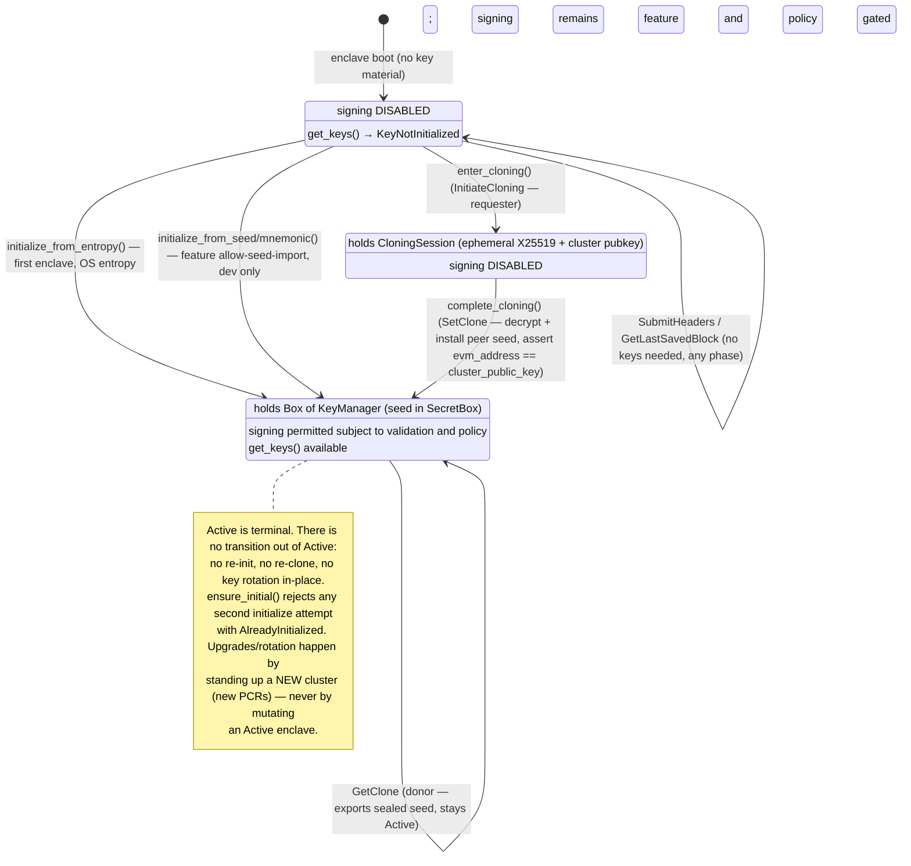

# Enclave key-state machine (`state.rs :: Phase`)

```mermaid
stateDiagram-v2
    [*] --> Initial : enclave boot (no key material)

    Initial : signing DISABLED
    Initial : get_keys() → KeyNotInitialized

    Cloning : holds CloningSession (ephemeral X25519 + cluster pubkey)
    Cloning : signing DISABLED

    Active : holds Box of KeyManager (seed in SecretBox)
    Active : signing permitted subject to validation and policy
    Active : get_keys() available; signing remains feature and policy gated

    Initial --> Active : initialize_from_entropy() — first enclave, OS entropy
    Initial --> Active : initialize_from_seed/mnemonic() — feature allow-seed-import, dev only
    Initial --> Cloning : enter_cloning() (InitiateCloning — requester)

    Cloning --> Active : complete_cloning() (SetClone — decrypt + install peer seed, assert evm_address == cluster_public_key)

    Active --> Active : Sign / SignBtc / SignRawDigest / SignCcd / GetAttestedPublicKey (no state change)
    Initial --> Initial : SubmitHeaders / GetLastSavedBlock (no keys needed, any phase)
    Active --> Active : GetClone (donor — exports sealed seed, stays Active)

    note right of Active
        Active is terminal. There is no transition out of Active:
        no re-init, no re-clone, no key rotation in-place.
        ensure_initial() rejects any second initialize attempt
        with AlreadyInitialized. Upgrades/rotation happen by
        standing up a NEW cluster (new PCRs) — never by mutating
        an Active enclave.
    end note
```
