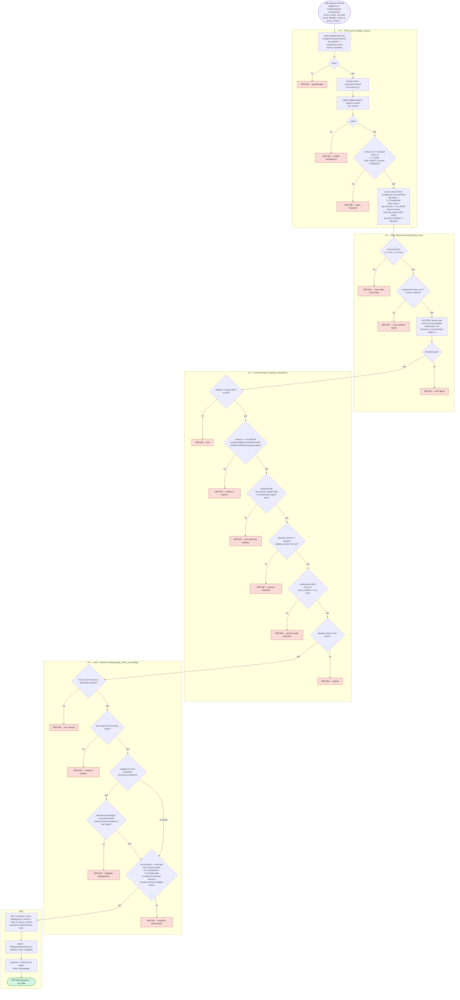

# `fundsOut` signing gate — TEE validation predicates (`handle_sign`)

### Notes

- `burnId` / `fundsInIds` inside the calldata are **preserved as received**
. The in-enclave OpId rewrite (`burnId` derived from the validated
  consignment OpId) is implemented but dormant until flows are
  routed by network id.
- Which unlock shape completes this gate is chosen at build time: an
  `rgb-swap` enclave signs `TS_TRANSFER` only, an `rgb-mint-burn` enclave
  `TS_BURN` only. They are separate instances with separate PCR0s; neither
  binary contains the other's rules.
- With `bfa-mint` (a mint/burn build on the bridged schema) the burn carries
  mint ancestry: every `TS_BRIDGE` behind it is checked against its own
  verified `FundsIn` lock before the gate completes.
- `dev-mode` builds bypass the validation subgraphs entirely; every dev
  feature is a `compile_error!` in release builds, and a release bridge build
  refuses to boot without a valid attested `Production` policy.

### Status

**Closed since the original review:** amount bound to the consignment (host
`rgb_amount` unused); canonical ABI validation; single pools selector,
pinned by an ABI-derived test; EIP-712 domain `MultisigProxy`/`1` pinned by a
deployed-contract fixture test; chain / contract / asset env-pinned; BtcRelay
proof agreement wired (inert until the listener populates it).

**Remaining gaps:**
- Recipient binding covers the burn path only: a `TS_BURN` commits its
  payout target in `MS_BURN_RECIPIENT` and the enclave refuses a release
  naming a different address. A swap's recipient is still unbound.
- OpId binding dormant (see note above); backend `burnId` is signed as
  received.
- Amount bind is coverage (`≥`), not strict `==` (per-output recipient-leg
  binding is).
