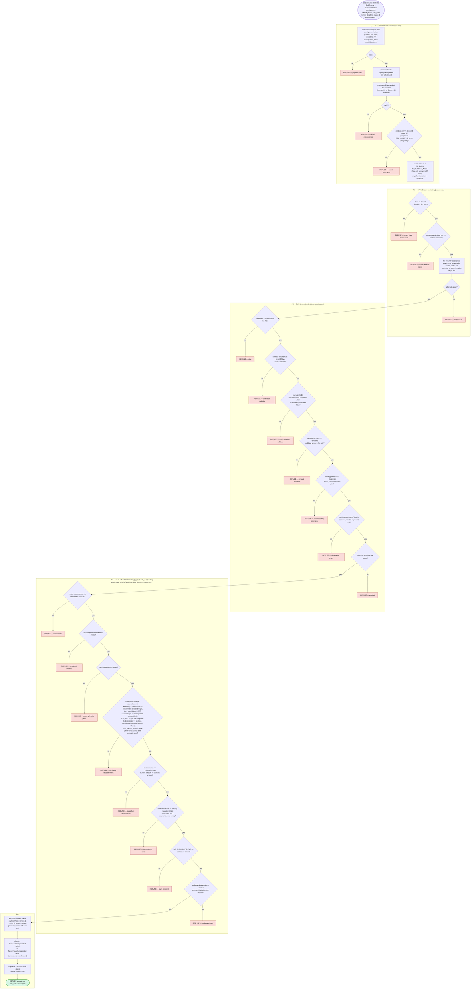

# `fundsOut` signing gate — burn signer (`handle_sign`)

Step-by-step text: [burn flow](../burn-flow.md).

```mermaid
flowchart TD
    start([Sign request received<br/>RgbSource + EvmDestination:<br/>consignment, merkle_proofs, call_data,<br/>nonce, deadline, chain_id, proxy_contract, ...])

    subgraph P1 ["P1 — RGB source (validate_source)"]
        p1w["cheap payload gate first:<br/>consignment bytes present, size caps,<br/>keccak256 == consignment_hash,<br/>asset_id declared"]
        p1w --> p1wq{pass?}
        p1wq -->|no| p1wr[REFUSE — payload gate]:::refuse
        p1wq -->|yes| p1a["Transfer::load + typesystem pinned<br/>per schema_id"]
        p1a --> p1b[rgb-ops validate against the resolver<br/>Electrum 15 s / Esplora 30 s timeout]
        p1b --> p1q{valid?}
        p1q -->|no| p1r[REFUSE — invalid consignment]:::refuse
        p1q -->|yes| p1c{"contract_id == declared asset_id<br/>(== pinned RGB_ASSET_ID when configured)?"}
        p1c -->|no| p1cr[REFUSE — asset mismatch]:::refuse
        p1c -->|yes| p1e["source amount = TS_BURN MS_BURNED_ASSET<br/>(host rgb_amount NOT used);<br/>any other transition ⇒ REFUSE"]
    end
    start --> p1w

    subgraph P3 ["P2 — SPV / Bitcoin anchoring (feature spv)"]
        p3stale{"chain tip fresh?<br/>≤ 2 h old, ≤ 2 h future"}
        p3stale -->|no| p3sr[REFUSE — chain stale, frozen feed]:::refuse
        p3stale -->|yes| p3net{consignment chain_net == enclave network?}
        p3net -->|no| p3nr[REFUSE — cross-network replay]:::refuse
        p3net -->|yes| p3v["for EVERY witness txid:<br/>exact proof set-equality,<br/>merkle path ≤ 32,<br/>inclusion vs stored header,<br/>depth ≥ 6"]
        p3v --> p3q{all proofs pass?}
        p3q -->|no| p3qr[REFUSE — SPV failure]:::refuse
    end
    p1e --> p3stale

    subgraph P2 ["P3 — EVM destination (validate_destination)"]
        p2len{"calldata ≥ 4 bytes AND ≤ 64 KiB?"}
        p2len -->|no| p2lenr[REFUSE — size]:::refuse
        p2len -->|yes| p2sel{"selector is fundsOut 0x340276aa<br/>or lzFundsOut?"}
        p2sel -->|no| p2selr[REFUSE — unknown selector]:::refuse
        p2sel -->|yes| p2abi{"canonical ABI:<br/>decode FundsOutParams AND<br/>re-encode byte-equals input?"}
        p2abi -->|no| p2abir[REFUSE — non-canonical calldata]:::refuse
        p2abi -->|yes| p2am{"decoded amount == declared<br/>calldata_amount, fits u64?"}
        p2am -->|no| p2amr[REFUSE — amount mismatch]:::refuse
        p2am -->|yes| p2p{"config pinned AND chain_id /<br/>proxy_contract == env pins?"}
        p2p -->|no| p2pr[REFUSE — pinned-config mismatch]:::refuse
        p2p -->|yes| p2dc{"calldata destinationChainId:<br/>pools == pin / LZ != pin and > 0?"}
        p2dc -->|no| p2dcr[REFUSE — destination chain]:::refuse
        p2dc -->|yes| p2d{deadline strictly in the future?}
        p2d -->|no| p2dr[REFUSE — expired]:::refuse
    end
    p3q -->|yes| p2len

    subgraph P4 ["P4 — route + fundsOut binding (apply_funds_out_binding)<br/>pools route only; lzFundsOut skips after the route check"]
        p4r{"route: source amount ≥ destination amount?"}
        p4r -->|no| p4rr[REFUSE — not covered]:::refuse
        p4r -->|yes| p4w{all consignment witnesses mined?}
        p4w -->|no| p4wr[REFUSE — unmined witness]:::refuse
        p4w -->|yes| p4b{"calldata proof non-empty?"}
        p4b -->|no| p4br[REFUSE — missing finality proof]:::refuse
        p4b -->|yes| p4bv{"proof (sourceHeight, sourceCommit,<br/>latestHeight, latestCommit):<br/>header held at latestHeight,<br/>tip − latestHeight ≤ 100,<br/>sourceHeight == consignment anchor block,<br/>BTC_RELAY_MODE=required: both commits == enclave-rebuilt relay records (zero ⇒ refuse);<br/>BTC_RELAY_MODE=none (never production): both commits zero?"}
        p4bv -->|no| p4bvr[REFUSE — BtcRelay disagreement]:::refuse
        p4bv -->|yes| p4t{"last transition == TS_BURN AND<br/>burned amount == calldata amount?"}
        p4t -->|no| p4tr[REFUSE — fundsOut amount bind]:::refuse
        p4t -->|yes| p4id{"sourceBurnTxId == settling transition OpId<br/>(non-zero) AND sourceAddress empty?"}
        p4id -->|no| p4idr[REFUSE — burn identity bind]:::refuse
        p4id -->|yes| p4rc{"MS_BURN_RECIPIENT == calldata recipient?"}
        p4rc -->|no| p4rcr[REFUSE — burn recipient]:::refuse
        p4rc -->|yes| p4st{"settlementData pairs == verified<br/>ancestry BridgeFundsIn records?"}
        p4st -->|no| p4str[REFUSE — settlement bind]:::refuse
    end
    p2d -->|yes| p4r

    subgraph S [Sign]
        s1["EIP-712 domain: name MultisigProxy, version 1,<br/>chain_id, proxy_contract<br/>(pinned by contract-fixture test)"] --> s2["digest = TeeFundsOut(decoded fields)<br/>or TeeLzFundsOut(decoded fields,<br/>lz_release cross-checked)"]
        s2 --> s3[signature = ECDSA over digest<br/>Active KeyManager]
        s3 --> sR([RETURN signature + call_data unchanged]):::accept
    end
    p4st -->|yes| s1

    classDef refuse fill:#FADBD8,stroke:#922,color:#222
    classDef accept fill:#D5F5E3,stroke:#292,color:#222
```

### Notes

- Pools route (`fundsOut`): `sourceBurnTxId` is bound to the burn OpId,
  `sourceAddress` to empty, `settlementData` to the verified mint ancestry,
  amount and recipient to the burn metadata. `burnId` is recomputed in the
  enclave on both routes (`validate_burn_id`).
- LayerZero route (`lzFundsOut`): P4 stops after the route check
  (burned amount >= calldata amount). The other P4 binds do not run. See
  [the spec](../tee-spec.md#13-implementation-status).
- The burn signer verifies the mint ancestry locks through the pinned TLS EVM
  RPC before RGB validation. This diagram starts after that step.
- Each dev feature is a `compile_error!` in release builds. A release bridge
  build refuses to boot without a valid attested `Production` policy.
