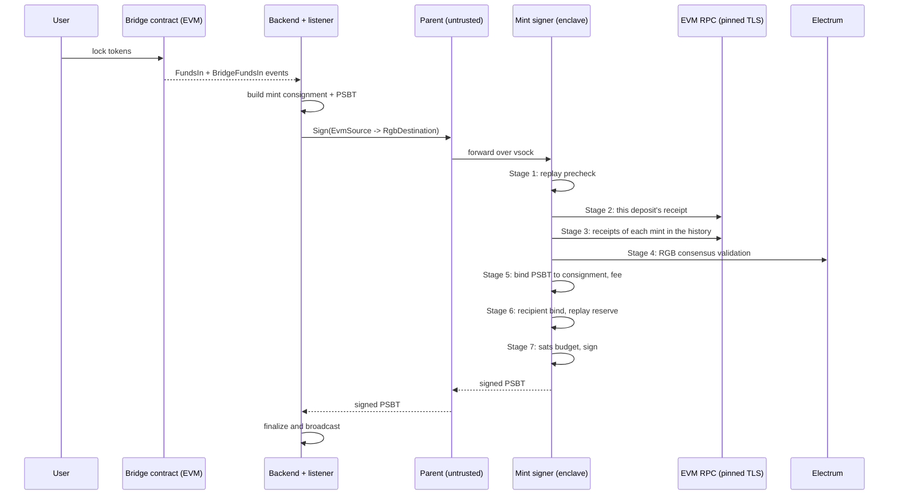

# Mint flow (EVM -> RGB)

**Signer image:** `mint-signer` (`--no-default-features --features vsock,rgb,mint-signer`).
**Checked against repository code:** 2026-10-05. Deployment was not checked.

This document tells how the mint signer checks and signs a mint. The
[spec](tee-spec.md) describes the rules and known limits. If the code and this
document differ, investigate the difference. Either can contain an error.

## 1. What the mint flow does

1. The user locks ERC-20 tokens in the Bridge contract on EVM.
2. The Bridge contract writes a `FundsIn` event and a `BridgeFundsIn` event.
3. The backend makes an RGB mint (a BFA `Bridge` transition) and a Bitcoin
   PSBT that anchors it.
4. The mint signer checks the deposit, the mint and the PSBT.
5. The mint signer signs the PSBT with its colored taproot key.
6. The backend finalizes and broadcasts the Bitcoin transaction.
7. The recipient validates the RGB transfer and waits for the required confirmations.

## 2. Who does what

| Part | Where | Trusted for | Job |
|------|-------|-------------|-----|
| User | EVM | - | Locks tokens. |
| Bridge contract | EVM | Deposit records | Holds the tokens. Writes the deposit events. |
| Backend and listener | Operator servers | Nothing | Build the consignment and the PSBT. Send the request. |
| Parent | EC2 host | Nothing | Moves bytes. Relays KMS and S3 traffic for the seed. |
| Mint signer | Nitro Enclave | Checks and keys | Checks the deposit and the mint. Signs the PSBT. |
| EVM RPC | Pinned TLS host | Receipt and chain-head data | Gives the deposit receipts. |
| Electrum | Through vsock proxy | Bitcoin data, subject to the checks below | Supplies transactions and witness status for RGB validation. |

The mint signer ignores `event_valid` and `event_finalized` from the listener.
It checks deposits through the pinned EVM RPC. It trusts that provider for
receipt and chain-head data. It does not verify EVM consensus.

The mint path does not verify witness inclusion against the enclave SPV chain.
RGB validation uses the Electrum resolver. The PSBT check binds the new
transaction to the consignment before that transaction is mined.

## 3. Sequence

## 4. Key values

| Name | Value | Meaning |
|------|-------|---------|
| `TS_BRIDGE` | 8014 | Mint transition. The only transition the mint signer accepts. |
| `OS_ASSET` | 4000 | Output that holds RGB units (u64). |
| `OS_BRIDGE` | 4014 | The mint right. It holds no units. It does not count in the amount. |
| `EVM_MIN_CONFIRMATIONS` | 12 (default) | Minimum depth of each deposit receipt. Attested. Production refuses 0. |
| `MAX_CONSIGNMENT_BYTES` | 8 MiB (default) | Maximum consignment size. |
| `MAX_OFF_TX_CHANGE_OUTPOINTS` | 4 | Maximum change outpoints outside the PSBT. |
| `MAX_FEE_RATE_SAT_VB` | 200 | Maximum fee rate, over the unsigned size. |
| `MAX_FEE_SATS` | 100 000 | Maximum fee. |
| `MIN_FEE_RATE_SAT_VB` | 1 | Minimum fee rate, over the estimated signed size. |
| `RGB_MAX_UNOWNED_SATS` | not set in the mint image | Maximum sats that go to scripts the enclave does not own. Not set: refuse every mint PSBT. |
| Replay window | 24 h, 100 000 entries | In memory, per enclave. |
| Colored account | `m/86'/827166'/0'` (mainnet) | The only account that signs a mint. |
| Amount rule | `sum(OS_ASSET) == amount - commission` | Exact. Not a minimum. |

## 5. Checks, in order

If one check fails, the mint signer stops. It signs nothing. It returns an
error.

### Stage 0 - Can this enclave do this request?

- **M0.1** The endpoints must be set (`SetEndpoints`).
- **M0.2** The source must be EVM and the destination must be RGB. The mint
  signer refuses a burn request.

The enclave must be `Active`, but no check runs here. The first check that
reads the keys (Stage 5) refuses an enclave without keys.

### Stage 1 - Is this a repeat?

- **M1.1** The mint signer makes a replay key from `chain_id`, the proxy
  contract, `evm_tx_hash`, `funds_in_operation_id` and the asset id.
- **M1.2** If the replay cache still holds this key, the signer refuses it.
  Entries expire after 24 hours. Capacity pressure can remove them earlier.
  This check records nothing. It runs before any network call.

### Stage 2 - Is this deposit real?

The mint signer gets the receipt itself, through TLS to the pinned EVM RPC
host. TLS ends inside the enclave. Each call has a 15 s timeout.

- **M2.1** `evm_tx_hash` and `funds_in_operation_id` must each be 32 bytes.
- **M2.2** The receipt must exist and must be a success.
- **M2.3** The receipt must have exactly one `BridgeFundsIn` event from the
  pinned `FUNDS_IN_CONTRACT`. Zero or two events: refuse.
- **M2.4** The event `operationId` (topic 1) must equal the request's
  `funds_in_operation_id`. All 32 bytes must match.
- **M2.5** The event `amount` must equal the request amount. The event
  `tokenCommission` must equal the request commission.
- **M2.6** `netAmount` must not be more than `amount - commission`.
- **M2.7** Each amount must fit in a u64. The mint signer does not cut a
  larger value. It refuses it.
- **M2.8** The receipt must be at least `EVM_MIN_CONFIRMATIONS` blocks deep. A
  receipt above the chain head (a reorg) is refused.

### Stage 3 - Does each mint have a deposit?

- **M3.1** The asset's `bridgeLocation` must equal the pinned
  `FUNDS_IN_CONTRACT`.
- **M3.2** The last mint must be the mint of this request. It pairs with
  `evm_tx_hash`.
- **M3.3** Each mint's deposit id is derived from the mint (see burn-flow
  B1.3); `mint_ancestors` is ignored.
- **M3.4** The receipt of `evm_tx_hash` must have exactly one `FundsIn` event
  with the last mint's RGB OpId, and exactly one `BridgeFundsIn` event, both
  from `FUNDS_IN_CONTRACT`, at least `EVM_MIN_CONFIRMATIONS` deep. Its
  `operationId`, amount and net amount must be the ones the last mint derives.
  Another deposit for the same OpId is refused.

### Stage 4 - Is the RGB history valid?

- **M4.1** The consignment must not be empty. It must not be larger than
  `MAX_CONSIGNMENT_BYTES`.
- **M4.2** `keccak256(consignment)` must equal `consignment_hash`. This check
  finds a damaged copy only. It is not a safety proof.
- **M4.3** Full RGB consensus validation runs. BFA is the only schema. Each
  mint must match a verified deposit from Stage 3. No verified deposit:
  refuse.
- **M4.4** The contract id must equal the declared `asset_id` and the pinned
  `RGB_ASSET_ID`.

### Stage 5 - Does the PSBT do this mint, and only this mint?

- **M5.1** The PSBT must parse and have at least one input.
- **M5.2** The last transition must be `TS_BRIDGE`.
- **M5.3** The PSBT txid must equal the last witness txid. So the signature
  can complete this one transaction only.
- **M5.4** Each input must be a SegWit output with a `witness_utxo`. So the
  unsigned txid is the final txid.
- **M5.5** The PSBT inputs must equal the witness inputs, when the
  consignment has the full transaction.
- **M5.6** Each sighash type must be `SIGHASH_ALL` or taproot `DEFAULT`.
- **M5.7** Each transition that the PSBT commits to must be a mint.
- **M5.8** The `OS_ASSET` outputs must sum to **exactly**
  `amount - commission`. A larger sum is an over-mint.
- **M5.9** Each `OS_ASSET` output is a leg:
  - a blinded seal is a recipient leg;
  - a revealed seal must be owned by the enclave. If not: refuse.
  - The recipient legs must sum to exactly `amount - commission`.
- **M5.10** Fee:
  - not more than 100 000 sats;
  - not more than 200 sat/vB over the unsigned size;
  - not less than 1 sat/vB over the estimated signed size.
  - If the enclave cannot estimate the size of an input, it refuses.

The mint signer does not get a fee estimate from outside. A changing estimate
could block a mint after its deposit is final. The bridge must check the
market fee before the user locks tokens.

### Stage 6 - Does the mint pay the correct user?

- **M6.1** The amount must cover the recipient legs plus the commission.
- **M6.2** If the deposit event has a `destinationAddress`, it is an RGB
  invoice. Only a blinded seal is accepted. The consignment must have exactly
  one blinded leg, and it must equal that seal.
- **M6.3** If the `destinationAddress` is empty (the v2 Bridge), the deposit
  binds the user through the mint OpId (M3.4). The mint transition commits
  to its seals.
- **M6.4** The mint signer reserves the replay key.

### Stage 7 - Sign

- **M7.1** The sats that go to scripts the enclave does not own must not be
  more than `RGB_MAX_UNOWNED_SATS`.
- **M7.2** The mint signer signs only inputs of the colored account. It uses
  Taproot key-path signatures with BIP-86 account keys. A Tapret or script-tree
  root can be part of the tweak. It never produces script-path signatures.
- **M7.3** For each input, the derived key must equal the internal key, and
  the tweak must give the output key. A false origin claim fails here.
- **M7.4** Zero signed inputs is an error.
- **M7.5** The response is `SignedPsbtResponse { signed_psbt, inputs_signed }`.
  The PSBT is not finalized.
- **M7.6** The replay reservation is committed after the response write
  succeeds. A failed write releases it. A successful write does not prove
  that the caller received the response. A retry can therefore be refused.

## 6. Replay

The replay guard is in memory and per enclave. It does not survive a restart.
Other replicas do not share it. Bitcoin stops a double spend of the same
inputs. But the guard alone does not stop a new PSBT for the same deposit
after a restart, cache expiry, capacity eviction, or on a different replica.

## 7. Plain BTC (`SignBtc`)

The mint signer also signs plain Bitcoin PSBTs (for example, to make UTXOs).

- The attested policy must allow it (`allow_vanilla_psbt`). This needs a
  non-zero `BTC_MAX_TOTAL_SATS`.
- Only the vanilla account signs. A colored input is never signed here.
- The total input value must not be more than `BTC_MAX_TOTAL_SATS`.
- Outputs that do not go back to enclave custody must not be more than
  `BTC_MAX_UNOWNED_SATS`.
- The same fee limits apply as in M5.10.
- There is no rate limit. The limits apply to one transaction.

## 8. What the mint signer refuses

| Request | Result |
|---------|--------|
| `Sign` with an RGB source or an EVM destination (burn) | Refused: wrong signer role. |
| `SignRawDigest` (gas transaction) | Refused: wrong signer role. |
| `InitiateCloning`, `GetClone`, `SetClone` | Refused: the seed comes from KMS. |
| `SignRawMessage` | Refused in every build. |

## 9. Seed

The mint signer gets its seed from AWS KMS. The encrypted seed is in S3. Mint
replicas recover the same seed. See [KMS seed persistence](kms-persistence.md).

## 10. The main idea

A mint spends the mint right (`OS_BRIDGE`, no units) and makes units
(`OS_ASSET`). The amount is checked three times:

1. RGB consensus: each mint equals a verified `FundsIn` deposit.
2. The PSBT bind: the new units equal `amount - commission`.
3. The recipient bind: the units go to the user's seal.
